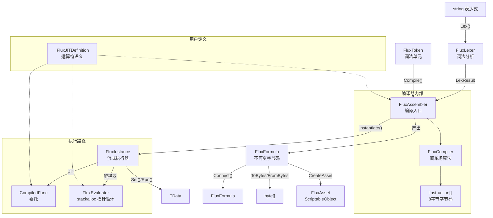

# API 总览

## 类型关系图



## Public 类型

| 类型 | 泛型 | 定位 |
|------|:--:|------|
| [FluxAssembler](./flux-assembler) | `<TData, TOper, TDef>` | 主入口：编译与实例化 |
| [FluxFormula](./flux-formula) | `<TData, TOper>` | 不可变字节码容器 |
| [FluxInstance](./flux-instance) | `<TData, TOper, TDef>` | ref struct 流式执行器 |
| [IFluxDefinition](./idefinition) | `<TData, TOper>` | 运算符定义接口（解释器路径） |
| [IFluxJITDefinition](./idefinition) | `<TData, TOper>` | 运算符定义接口（含 JIT 路径） |
| [Instruction](./instruction) | — | 8 字节指令结构体 |
| [FluxToken](./flux-token) | `<TData, TOper>` | 词法 Token |
| `LexerConfig<TData, TOper>` | `<TData, TOper>` | Lexer 配置（运算符/括号/变量规则） |
| `FluxLexer<TData, TOper>` | `<TData, TOper>` | 手写 Span 词法器 |
| `LexResult<TData, TOper>` | `<TData, TOper>` | Lexer 产出：Token 数组 + 变量名 |
| `OperatorRule<TOper>` | `<TOper>` | 运算符符号到枚举的映射 |
| `BracketRule<TOper>` | `<TOper>` | 括号符号对到枚举的映射 |
| `VariablePatternRule` | — | 变量前缀/后缀模式定义 |
| `OpPair<TOper>` | `<TOper>` | 括号配对描述 |
| `FluxAsset` | — | ScriptableObject 资产容器 |
| `FluxConfigAsset` | — | ScriptableObject 全局配置容器（`Resources.Load` 自动加载） |
| `FormulaLibrary<TData, TOper, TDef>` | `<TData, TOper, TDef>` | 资产创建与加载（需 FLUX_ADDRESSABLES） |
| `FluxFormulaRef<TData, TOper, TDef>` | `<TData, TOper, TDef>` | AssetReference 类型安全包装（需 FLUX_ADDRESSABLES） |
| `VariableSlot` | — | 变量名到槽位索引的映射 |
| [DualHash64](./dualhash64) | — | 128-bit 双哈希（xxHash64 + FNV-1a 64），内容寻址缓存键 |
| `Registers` | — | 寄存器语义常量（Error=0, Bus=1, FirstAlloc=2, Max=255） |
| [FluxConfig](./flux-config) | — | 项目级全局配置（FormulaCacheCapacity, MergeThreshold, BlobFilePath, DiskCacheDirectory） |
| [FormulaCache](./formula-cache) | — | 2048 槽开放寻址哈希表缓存 |
| [IFluxCacheProvider](./iflux-cache-provider) | — | 可替换缓存后端接口 |
| [FormulaFormat](./formula-format) | — | `.ff` 公式字节码格式定义（HeaderSize=14） |
| `BinaryFormat` | — | 小端序二进制读写原语 |
| [VffFormat](./vff-format) | — | `.vff` 虚拟公式格式定义、编码与解析 |
| [FluxArtifactKind](./flux-artifact-kind) | — | 二进制产物类型枚举（`.ff` / `.vff`） |
| [IFluxBinaryBuilder](./iflux-binary-builder) | — | 最小持久化契约接口（外部保存器注入） |
| `FluxBlob` | — | Blob pinned 内存管理器（Initialize/Shutdown/VerifyIntegrity） |
| `FluxBlobBuilder` | — | 离线构建管线（扫描 FluxAsset → 拼接 blob → 生成 C# 偏移表） |

### 内部类型

以下类型非 Public API，仅列示用途：

- `FluxPlatform` — JIT 降级状态控制
- `FluxEvaluator<TData, TOper, TDef>` — 解释器执行引擎
- `FluxCompiler<TData, TOper, TDef>` — 调车场算法编译器
- `FluxJITCompiler<TData, TOper, TDef>` — LINQ Expression Tree JIT
- `FluxInjector<TData>` — 数据注入器
- `FormulaCache` — 静态单例缓存，DualHash64 → (字节码指针 + 长度 / JIT delegate)
- `FluxCompiler<TData, TOper, TDef>` — 调车场算法实现
- `FluxJITCompiler<TData, TOper, TDef>` — LINQ Expression Tree 编译
- `FluxInjector<TData>` — 数据注入器

## 命名空间

- **`FluxFormula.Core`** — 所有公共类型与内部运行时类型
- **`FluxFormula.Compiler`** — `FluxCompiler` 与 `FluxJITCompiler`（内部）
- **`FluxFormula.Editor`** — `FluxAssetEditor`、`FluxAssetInspector`、Dump 扩展（Editor-only）

## 泛型约束

```
TData  : unmanaged               (float, int, 自定义 blittable struct)
TOper  : unmanaged, Enum         (必须 enum X : byte)
TDef   : unmanaged, IFluxJITDefinition<TData, TOper>
```
