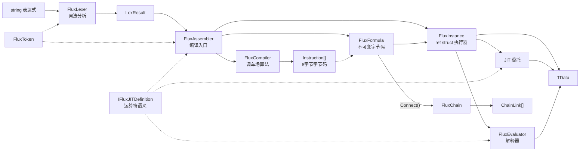
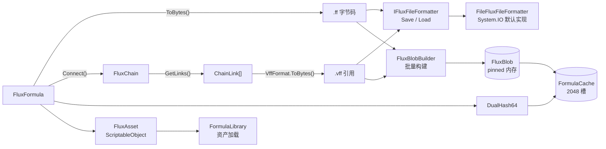

# API 总览

## 编译与执行管线



## 持久化与缓存



## Public 类型

| 类型 | 泛型 | 定位 |
|------|:--:|------|
| [FluxAssembler](./flux-assembler) | `<TData, TDef>` | 主入口：编译与实例化 |
| [FluxFormula](./flux-formula) | `<TData, TDef>` | 不可变字节码容器（完整公式，永远原子） |
| [FluxChain](./flux-chain) | `<TData, TDef>` | 不可变链式字节码容器（Connect 串联产物） |
| `FluxModifier` | `<TData, TDef>` | 不可变字节码容器（缺左操作数，仅可串联） |
| [FluxInstance](./flux-instance) | `<TData, TDef>` | ref struct 流式执行器 |
| [IFluxDefinition](./idefinition) | `<TData>` | 运算符定义接口（解释器路径） |
| [IFluxJITDefinition](./idefinition) | `<TData>` | 运算符定义接口（含 JIT 路径） |
| [Instruction](./instruction) | — | 8 字节指令结构体 |
| [FluxToken](./flux-token) | `<TData>` | 词法 Token（`Oper` 为 `byte`） |
| `FluxLexer<TData>` | `<TData>` | 手写 Span 词法器 |
| `LexResult<TData>` | `<TData>` | Lexer 产出：Token 数组 + 变量名 |
| `LexerConfig<TData>` | `<TData>` | Lexer 配置（运算符/括号/变量规则） |
| `VariableSlot` | — | 变量名到槽位索引的映射 |
| [DualHash64](./dualhash64) | — | 128-bit 双哈希（xxHash64 + FNV-1a 64），内容寻址缓存键 |
| [FluxConfig](./flux-config) | — | 项目级全局配置 |
| [FormulaCache](./formula-cache) | — | 2048 槽开放寻址哈希表缓存 |
| [IFluxCacheProvider](./iflux-cache-provider) | — | 可替换缓存后端接口 |
| [FormulaFormat](./formula-format) | — | `.ff` 公式字节码格式定义（HeaderSize=14） |
| [VffFormat](./vff-format) | — | `.vff` 虚拟公式格式定义、编码与解析 |
| [FluxArtifactKind](./flux-artifact-kind) | — | 二进制产物类型枚举（`.ff` / `.vff`） |
| [IFluxFileFormatter](./iflux-file-formatter) | — | 最小持久化契约接口（含 `FileFluxFileFormatter` 内置实现） |
| `FluxAsset` | — | ScriptableObject 资产容器 |
| `FluxBlob` | — | Blob pinned 内存管理器 |
| `FluxBlobBuilder` | — | 离线构建管线 |

### 内部类型

以下类型非 Public API，仅列示用途：

- `FluxType` — 内部枚举（Formula / Modifier），v3.0.0 改为 `internal`
- `FluxPlatform` — JIT 降级状态控制
- `ChainLink` — 链式公式环节结构体（public struct，通过 `FluxChain.GetLinks()` 访问）
- `FluxEvaluator<TData, TDef>` — 解释器执行引擎
- `FluxCompiler<TData, TDef>` — 调车场算法编译器
- `FluxJITCompiler<TData, TDef>` — LINQ Expression Tree JIT
- `FluxInjector<TData>` — 数据注入器
- `OpPair` — 括号配对描述（非泛型）

## 命名空间

- **`FluxFormula.Core`** — 所有公共类型与内部运行时类型
- **`FluxFormula.Compiler`** — `FluxCompiler` 与 `FluxJITCompiler`（内部）
- **`FluxFormula.Editor`** — `FluxAssetEditor`、`FluxAssetInspector`、Dump 扩展（Editor-only）

## 泛型约束

```
TData  : unmanaged               (float, int, 自定义 blittable struct)
TDef   : unmanaged, IFluxJITDefinition<TData>
```

v3.0.0 移除了 `TOper` 泛型参数：操作符枚举变为定义体的内部实现细节。
