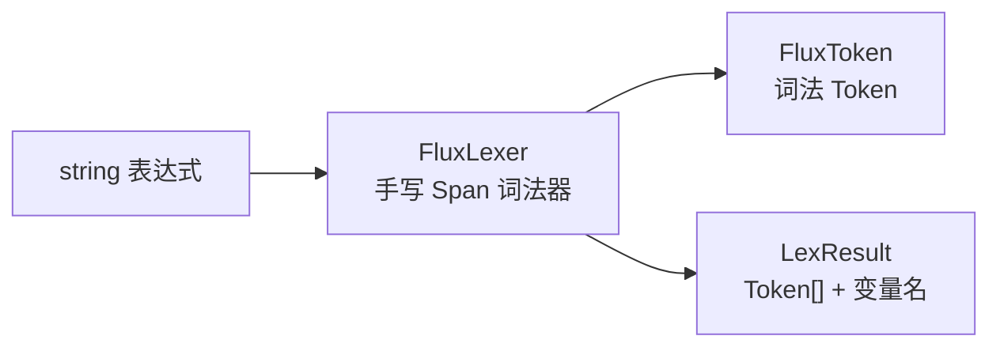
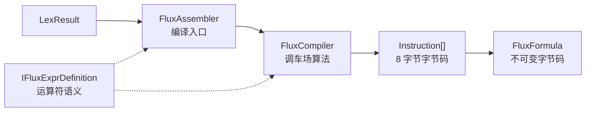
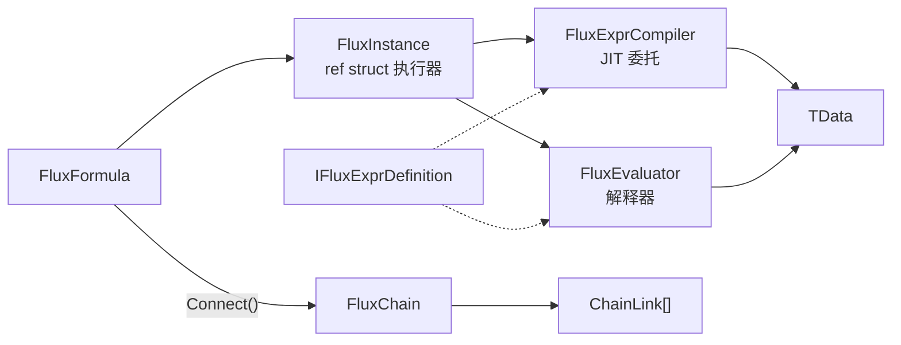
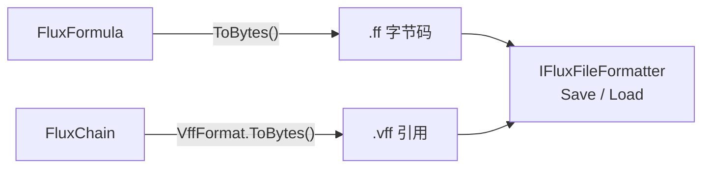
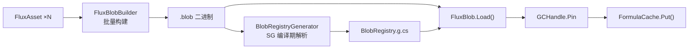
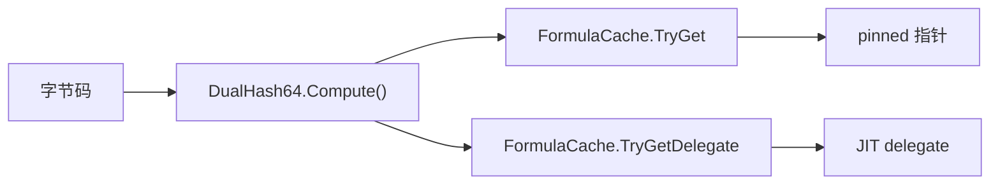
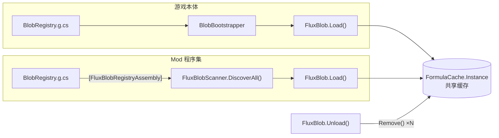

# API 总览

## 词法分析



## 编译



## 执行



## 文件持久化



## Blob 管线



## 缓存查找



## Blob Mod 架构



## Public 类型

| 类型 | 泛型 | 定位 |
|------|:--:|------|
| [FluxAssembler](./flux-assembler) | `<TData, TDef>` | 主入口：编译与实例化 |
| [FluxFormula](./flux-formula) | `<TData, TDef>` | 不可变字节码容器（完整公式，永远原子） |
| [FluxChain](./flux-chain) | `<TData, TDef>` | 不可变链式字节码容器（Connect 串联产物） |
| `FluxModifier` | `<TData, TDef>` | 不可变字节码容器（缺左操作数，仅可串联） |
| [FluxInstance](./flux-instance) | `<TData, TDef>` | ref struct 流式执行器 |
| [FluxCurryEvaluator](./flux-curry-evaluator) | `<TData, TDef>` | 变量级分步求值器（函数式 State→State） |
| [FluxStepEvaluator](./flux-step-evaluator) | `<TData, TDef>` | 指令级单步调试器（逐条 Step） |
| [IFluxDefinition](./idefinition) | `<TData>` | 运算符定义接口（解释器路径） |
| [IFluxExprDefinition](./idefinition) | `<TData>` | 运算符定义接口（含 JIT 路径） |
| [Instruction](./instruction) | — | 8 字节指令结构体 |
| [FluxToken](./flux-token) | `<TData>` | 词法 Token（`Oper` 为 `byte`） |
| [FluxLexer](./flux-lexer) | `<TData>` | 手写 Span 词法器（含 `LexerConfig`、`LexResult`） |
| [FluxCurryEvaluator](./flux-curry-evaluator) | `<TData, TDef>` | 变量级分步求值器（函数式 State→State） |
| [FluxStepEvaluator](./flux-step-evaluator) | `<TData, TDef>` | 指令级单步调试器（逐条 Step） |
| `VariableSlot` | — | 变量名到槽位索引的映射 |
| [DualHash64](./dualhash64) | — | 128-bit 双哈希（xxHash64 + FNV-1a 64），内容寻址缓存键 |
| [FluxConfig](./flux-config) | — | 项目级全局配置 |
| [FormulaCache](./formula-cache) | — | 2048 槽开放寻址哈希表缓存 |
| [IFluxCacheProvider](./iflux-cache-provider) | — | 可替换缓存后端接口 |
| [VffFormat](./vff-format) | — | `.vff` 虚拟公式格式定义、编码与解析 |
| [FluxArtifactKind](./flux-artifact-kind) | — | 二进制产物类型枚举（`.ff` / `.vff`） |
| [IFluxFileFormatter](./iflux-file-formatter) | — | 最小持久化契约接口（含 `FileFluxFileFormatter` 内置实现） |
| [BlobFormat](./blob-format) | — | `.blob` 二进制格式定义与解析 |
| [BlobEntry](./blob-entry) | — | 偏移表条目：DualHash64 → offset + length |
| [FluxBlob](./flux-blob) | — | Blob 加载/卸载门面（含 `FluxBlobHandle`） |
| [IFluxBlobRegistry](./iflux-blob-registry) | — | Mod 公式注册表接口（含 `FluxBlobScanner` 扫描器） |
| `FluxAsset` | — | ScriptableObject 资产容器 |
| `FluxBlobBuilder` | — | 离线构建管线 |

### 内部类型

以下类型非 Public API，仅列示用途：

- `FluxType` — 内部枚举（Formula / Modifier），v3.0.0 改为 `internal`
- `FluxPlatform` — JIT 降级状态控制
- `ChainReserved` — 链式求值内部变量前缀（v3.7 改为 `internal`）
- `ChainLink` — 链式公式环节结构体（public struct，通过 `FluxChain.GetLinks()` 访问）
- `FluxEvaluator<TData, TDef>` — 解释器执行引擎
- `FluxCompiler<TData, TDef>` — 调车场算法编译器
- `FluxExprCompiler<TData, TDef>` — LINQ Expression Tree JIT
- `FluxILCompiler<TData, TDef>` — IL 发射编译器（DynamicMethod 路径）
- `FluxInjector<TData>` — 数据注入器
- `CompiledFunc<TData>` — JIT 编译产出委托类型（v3.7 改为 `internal`）
- `BinaryFormat` — 小端序二进制读写原语（v3.7 改为 `internal`）
- `FormulaFormat` — `.ff` 字节码格式定义（v3.7 改为 `internal`）
- `FormulaHeader` — 公式字节码头结构体（v3.7 改为 `internal`）
- `FluxCompression` — Brotli 压缩原语（v3.7 改为 `internal`）
- `OpPair` — 括号配对描述（非泛型）
- `FluxBlobRegistryAssemblyAttribute` — 程序集级 SG 标记（通过 `IFluxBlobRegistry` 文档说明）

## 命名空间

- **`FluxFormula.Core`** — 所有公共类型与内部运行时类型
- **`FluxFormula.Compiler`** — `FluxCompiler` 与 `FluxExprCompiler`（内部）
- **`FluxFormula.Editor`** — `FluxAssetEditor`、`FluxAssetInspector`、Dump 扩展（Editor-only）

## 泛型约束

```
TData  : unmanaged               (float, int, 自定义 blittable struct)
TDef   : unmanaged, IFluxExprDefinition<TData>
```
