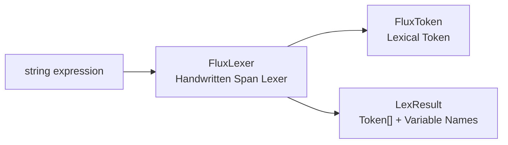
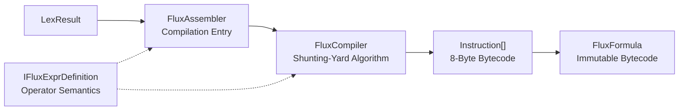
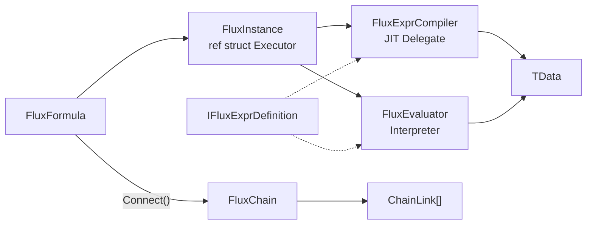
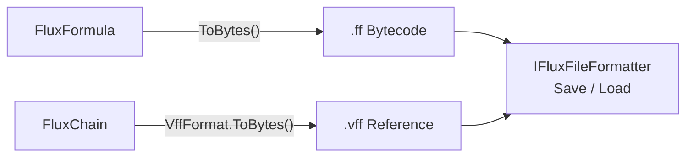
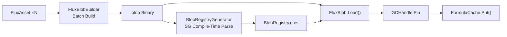
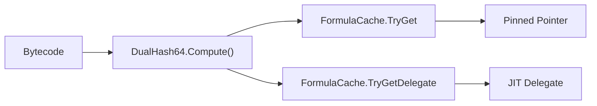
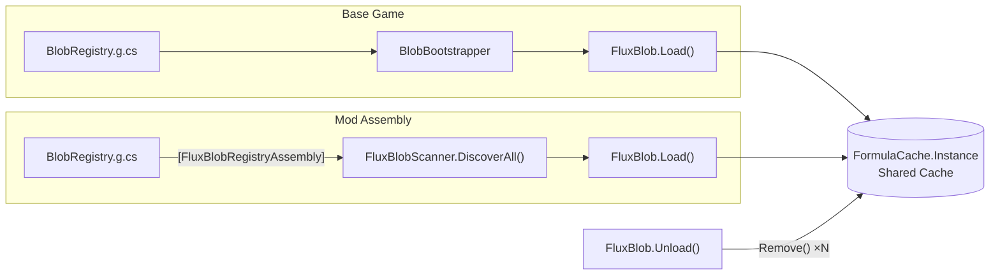

# API Overview

## Lexical Analysis



## Compilation



## Execution



## File Persistence



## Blob Pipeline



## Cache Lookup



## Blob Mod Architecture



## Public Types

| Type | Generics | Role |
|------|:------:|------|
| [FluxAssembler](./flux-assembler) | `<TData, TDef>` | Main entry: compilation and instantiation |
| [FluxFormula](./flux-formula) | `<TData, TDef>` | Immutable bytecode container (complete formula, always atomic) |
| [FluxChain](./flux-chain) | `<TData, TDef>` | Immutable chained bytecode container (Connect product) |
| `FluxModifier` | `<TData, TDef>` | Immutable bytecode container (no left operand; chain-only) |
| [FluxInstance](./flux-instance) | `<TData, TDef>` | ref struct streaming executor |
| [IFluxDefinition](./idefinition) | `<TData>` | Operator definition interface (interpreter path) |
| [IFluxExprDefinition](./idefinition) | `<TData>` | Operator definition interface (with JIT path) |
| [Instruction](./instruction) | — | 8-byte instruction struct |
| [FluxToken](./flux-token) | `<TData>` | Lexical token (`Oper` is `byte`) |
| `FluxLexer<TData>` | `<TData>` | Handwritten span lexer |
| `LexResult<TData>` | `<TData>` | Lexer output: token array + variable names |
| `LexerConfig<TData>` | `<TData>` | Lexer configuration (operators/brackets/variable rules) |
| `VariableSlot` | — | Variable name to slot index mapping |
| [DualHash64](./dualhash64) | — | 128-bit dual hash (xxHash64 + FNV-1a 64), content-addressable cache key |
| [FluxConfig](./flux-config) | — | Project-level global configuration |
| [FormulaCache](./formula-cache) | — | 2048-slot open-addressing hash table cache |
| [IFluxCacheProvider](./iflux-cache-provider) | — | Replaceable cache backend interface |
| [VffFormat](./vff-format) | — | `.vff` virtual formula format: encode, decode, and resolve |
| [FluxArtifactKind](./flux-artifact-kind) | — | Binary artifact kind enum (`.ff` / `.vff`) |
| [IFluxFileFormatter](./iflux-file-formatter) | — | Minimal persistence contract (includes built-in `FileFluxFileFormatter`) |
| [BlobFormat](./blob-format) | — | `.blob` binary format definition and parsing |
| [BlobEntry](./blob-entry) | — | Offset table entry: DualHash64 → offset + length |
| [FluxBlob](./flux-blob) | — | Blob load/unload facade (includes `FluxBlobHandle`) |
| [IFluxBlobRegistry](./iflux-blob-registry) | — | Mod formula registry interface (includes `FluxBlobScanner`) |
| `FluxAsset` | — | ScriptableObject asset container |
| `FluxBlobBuilder` | — | Offline build pipeline |

### Internal Types

The following types are not Public API and are listed for reference only:

- `FluxType` — Internal enum (Formula / Modifier), made `internal` in v3.0.0
- `FluxPlatform` — JIT fallback state control
- `ChainReserved` — Chain evaluation internal variable prefix (made `internal` in v3.7)
- `ChainLink` — Chain link struct (public struct, accessed via `FluxChain.GetLinks()`)
- `FluxEvaluator<TData, TDef>` — Interpreter execution engine
- `FluxCompiler<TData, TDef>` — Shunting-yard algorithm compiler
- `FluxExprCompiler<TData, TDef>` — LINQ Expression Tree JIT
- `FluxILCompiler<TData, TDef>` — IL emit compiler (DynamicMethod path)
- `FluxInjector<TData>` — Data injector
- `CompiledFunc<TData>` — JIT compiled delegate type (made `internal` in v3.7)
- `BinaryFormat` — Little-endian binary read/write primitives (made `internal` in v3.7)
- `FormulaFormat` — `.ff` bytecode format definition (made `internal` in v3.7)
- `FormulaHeader` — Formula bytecode header struct (made `internal` in v3.7)
- `FluxCompression` — Brotli compression primitives (made `internal` in v3.7)
- `OpPair` — Bracket pair descriptor (non-generic)
- `FluxBlobRegistryAssemblyAttribute` — Assembly-level SG marker (documented in `IFluxBlobRegistry`)

## Namespaces

- **`FluxFormula.Core`** — All public types and internal runtime types
- **`FluxFormula.Compiler`** — `FluxCompiler` and `FluxExprCompiler` (internal)
- **`FluxFormula.Editor`** — `FluxAssetEditor`, `FluxAssetInspector`, Dump extensions (Editor-only)

## Generic Constraints

```
TData  : unmanaged               (float, int, custom blittable struct)
TDef   : unmanaged, IFluxExprDefinition<TData>
```
