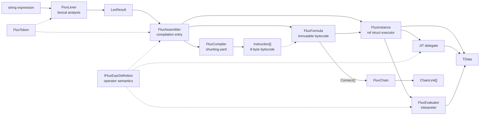
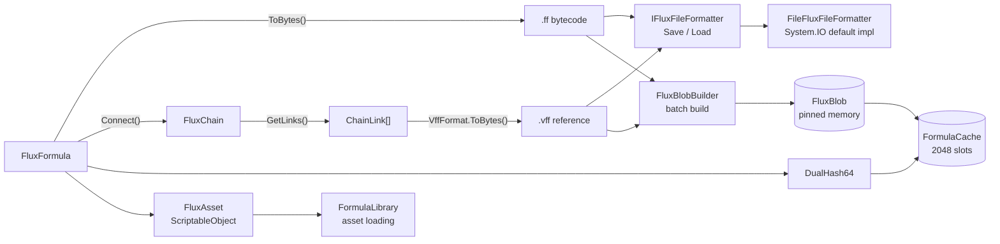

# API Overview

## Compilation & Execution Pipeline



## Persistence & Caching



## Public Types

| Type | Generics | Role |
|------|:--:|------|
| [FluxAssembler](./flux-assembler) | `<TData, TDef>` | Main entry: compile & instantiate |
| [FluxFormula](./flux-formula) | `<TData, TDef>` | Immutable bytecode container (complete formula, always atomic) |
| [FluxChain](./flux-chain) | `<TData, TDef>` | Immutable chained bytecode container (Connect product) |
| `FluxModifier` | `<TData, TDef>` | Immutable bytecode container (missing left operand, chain-only) |
| [FluxInstance](./flux-instance) | `<TData, TDef>` | ref struct streaming executor |
| [IFluxDefinition](./idefinition) | `<TData>` | Operator definition interface (interpreter path) |
| [IFluxExprDefinition](./idefinition) | `<TData>` | Operator definition interface (with JIT path) |
| [Instruction](./instruction) | — | 8-byte instruction struct |
| [FluxToken](./flux-token) | `<TData>` | Lexical token (`Oper` is `byte`) |
| `FluxLexer<TData>` | `<TData>` | Handwritten span lexer |
| `LexResult<TData>` | `<TData>` | Lexer output: token array + variable names |
| `LexerConfig<TData>` | `<TData>` | Lexer config (operators/brackets/variable rules) |
| `VariableSlot` | — | Variable name → slot index mapping |
| [DualHash64](./dualhash64) | — | 128-bit dual hash (xxHash64 + FNV-1a 64), content-addressable cache key |
| [FluxConfig](./flux-config) | — | Project-level global configuration |
| [FormulaCache](./formula-cache) | — | 2048-slot open-addressing hashmap cache |
| [IFluxCacheProvider](./iflux-cache-provider) | — | Replaceable cache backend interface |
| [VffFormat](./vff-format) | — | `.vff` virtual formula format definition, encoding & parsing |
| [FluxArtifactKind](./flux-artifact-kind) | — | Binary artifact type enum (`.ff` / `.vff`) |
| [IFluxFileFormatter](./iflux-file-formatter) | — | Minimal persistence contract interface (with `FileFluxFileFormatter` built-in impl) |
| `FluxAsset` | — | ScriptableObject asset container |
| `FluxBlob` | — | Blob pinned memory manager |
| `FluxBlobBuilder` | — | Offline build pipeline |

### Internal Types

The following types are not Public API, listed for reference only:

- `FluxType` — internal enum (Formula / Modifier), made `internal` in v3.0.0
- `FluxPlatform` — JIT degradation state control
- `ChainReserved` — chain evaluation internal variable prefix (made `internal` in v3.7)
- `ChainLink` — chain link struct (public struct, accessed via `FluxChain.GetLinks()`)
- `FluxEvaluator<TData, TDef>` — interpreter execution engine
- `FluxCompiler<TData, TDef>` — shunting-yard algorithm compiler
- `FluxExprCompiler<TData, TDef>` — LINQ Expression Tree JIT
- `FluxILCompiler<TData, TDef>` — IL emission compiler (DynamicMethod path)
- `FluxInjector<TData>` — data injector
- `CompiledFunc<TData>` — JIT compilation delegate type (made `internal` in v3.7)
- `BinaryFormat` — little-endian binary I/O primitives (made `internal` in v3.7)
- `FormulaFormat` — `.ff` bytecode format definition (made `internal` in v3.7)
- `FormulaHeader` — formula bytecode header struct (made `internal` in v3.7)
- `FluxCompression` — Brotli compression primitives (made `internal` in v3.7)
- `OpPair` — bracket pairing descriptor (non-generic)

## Namespaces

- **`FluxFormula.Core`** — all public types and internal runtime types
- **`FluxFormula.Compiler`** — `FluxCompiler` and `FluxExprCompiler` (internal)
- **`FluxFormula.Editor`** — `FluxAssetEditor`, `FluxAssetInspector`, Dump extensions (Editor-only)

## Generic Constraints

```
TData  : unmanaged               (float, int, custom blittable struct)
TDef   : unmanaged, IFluxExprDefinition<TData>
```

v3.0.0 removed the `TOper` generic parameter — the operator enum is now an internal implementation detail of the definition.
