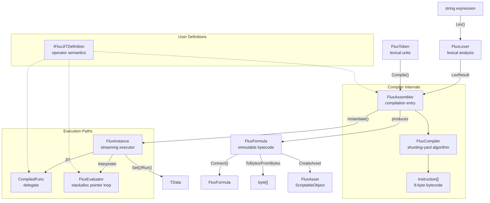

# API Overview

## Type Relationship Diagram



## Public Types

| Type | Generics | Role |
|------|:--:|------|
| [FluxAssembler](./flux-assembler) | `<TData, TOper, TDef>` | Main entry: compilation and instantiation |
| [FluxFormula](./flux-formula) | `<TData, TOper>` | Immutable bytecode container |
| [FluxInstance](./flux-instance) | `<TData, TOper, TDef>` | ref struct streaming executor |
| [IFluxDefinition](./idefinition) | `<TData, TOper>` | Operator definition interface (interpreter path) |
| [IFluxJITDefinition](./idefinition) | `<TData, TOper>` | Operator definition interface (with JIT path) |
| [Instruction](./instruction) | — | 8-byte instruction struct |
| [FluxToken](./flux-token) | `<TData, TOper>` | Lexical token |
| `LexerConfig<TData, TOper>` | `<TData, TOper>` | Lexer configuration (operators/brackets/variable rules) |
| `FluxLexer<TData, TOper>` | `<TData, TOper>` | Hand-written Span lexer |
| `LexResult<TData, TOper>` | `<TData, TOper>` | Lexer output: token array + variable names |
| `OperatorRule<TOper>` | `<TOper>` | Operator symbol-to-enum mapping |
| `BracketRule<TOper>` | `<TOper>` | Bracket symbol pair-to-enum mapping |
| `VariablePatternRule` | — | Variable prefix/suffix pattern definition |
| `OpPair<TOper>` | `<TOper>` | Bracket pair descriptor |
| `FluxAsset` | — | ScriptableObject asset container |
| `FluxConfigAsset` | — | ScriptableObject global config container (auto-loaded via `Resources.Load`) |
| `FormulaLibrary<TData, TOper, TDef>` | `<TData, TOper, TDef>` | Asset creation and loading (requires FLUX_ADDRESSABLES) |
| `FluxFormulaRef<TData, TOper, TDef>` | `<TData, TOper, TDef>` | Type-safe AssetReference wrapper (requires FLUX_ADDRESSABLES) |
| `VariableSlot` | — | Variable name to slot index mapping |
| [DualHash64](./dualhash64) | — | 128-bit dual hash (xxHash64 + FNV-1a 64), content-addressable cache key |
| `Registers` | — | Register semantic constants (Error=0, Bus=1, FirstAlloc=2, Max=255) |
| [FluxConfig](./flux-config) | — | Project-level global configuration (FormulaCacheCapacity, MergeThreshold, BlobFilePath, DiskCacheDirectory) |
| [FormulaCache](./formula-cache) | — | 2048-slot open-addressing hashmap cache |
| [IFluxCacheProvider](./iflux-cache-provider) | — | Replaceable cache backend interface |
| [FormulaFormat](./formula-format) | — | `.ff` formula bytecode format definition (HeaderSize=14) |
| `BinaryFormat` | — | Little-endian binary read/write primitives |
| [VffFormat](./vff-format) | — | `.vff` virtual formula format definition and resolution |
| `FluxBlob` | — | Blob pinned memory manager (Initialize/Shutdown/VerifyIntegrity) |
| `FluxBlobBuilder` | — | Offline build pipeline (scan FluxAsset → concatenate blob → generate C# offset table) |

### Internal Types

The following types are not public API, listed for reference only:

- `FluxPlatform` — JIT degradation state control
- `FluxEvaluator<TData, TOper, TDef>` — Interpreter execution engine
- `FluxCompiler<TData, TOper, TDef>` — Shunting-yard algorithm compiler
- `FluxJITCompiler<TData, TOper, TDef>` — LINQ Expression Tree JIT
- `FluxInjector<TData>` — Data injector
- `FormulaCache` — Static singleton cache, DualHash64 → (bytecode pointer + length / JIT delegate)
- `FluxCompiler<TData, TOper, TDef>` — Shunting-yard algorithm implementation
- `FluxJITCompiler<TData, TOper, TDef>` — LINQ Expression Tree compilation
- `FluxInjector<TData>` — Data injector

## Namespaces

- **`FluxFormula.Core`** — All public types and internal runtime types
- **`FluxFormula.Compiler`** — `FluxCompiler` and `FluxJITCompiler` (internal)
- **`FluxFormula.Editor`** — `FluxAssetEditor`, `FluxAssetInspector`, Dump extension (Editor-only)

## Generic Constraints

```
TData  : unmanaged               (float, int, custom blittable struct)
TOper  : unmanaged, Enum         (must be enum X : byte)
TDef   : unmanaged, IFluxJITDefinition<TData, TOper>
```
