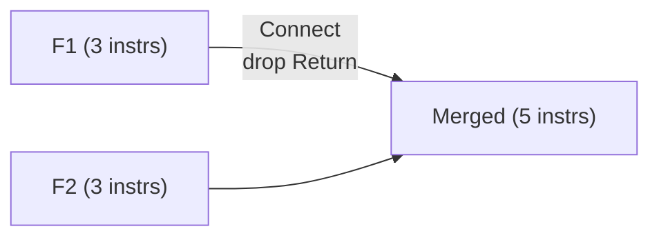
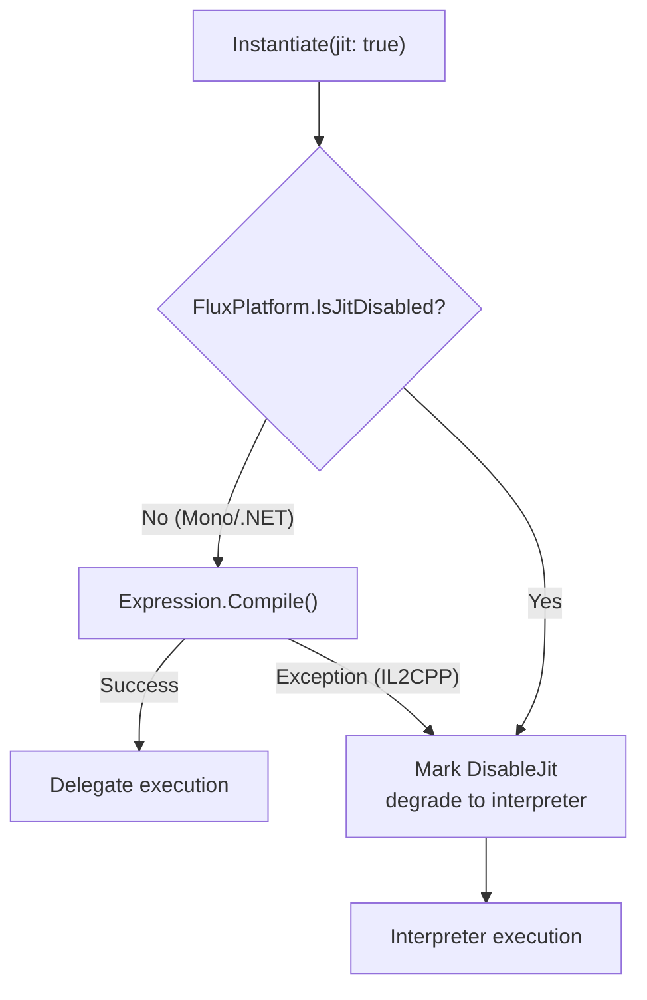

# Advanced Usage

## Connect: Formula Concatenation

`Connect()` joins two formulas: removes the trailing Return from the first, then appends the second formula's entire content.

```csharp
var f42 = runner.Compile(new[] { C(42f) });
// Bytecode: [Immediate(R2,42), Return(Dest=R2)]

// Empty formula concatenation, guard clause
var result = FluxFormula<float, FloatOp>.Empty.Connect(f42);
// Count=0 → returns f42 directly
```



### Register Conflicts

`Connect()` is a mechanical concatenation — it does not remap register numbers. If F1 uses R2-R5 and F2 also uses R2-R5, F2 will overwrite F1's register values. Suitable scenarios:

- Connecting an empty formula (no register conflict)
- F2 is a single-operand modifier that references R1 (the bus)

```csharp
// F2's Add injects R1 when missing an operand
var f1 = runner.Compile(new[] { C(40f) });               // R2 ← 40
var f2 = runner.Compile(new[] { Op(FloatOp.Add), C(2f) }); // R1 + 2
// F1's result is in R2, not R1. After Connect, F2 reads R1 and gets nothing.
// Register consistency across Connect is the caller's responsibility.
```

## Set: Named Variable Injection

Define variable patterns via the Lexer at compile time. Inject values by name at runtime. All variables with the same name are written. `Set()` uses an inline binary search to locate variable slots, zero GC. Throws `ArgumentException` if the name was not defined in `VariablePatterns`.

```csharp
var config = new LexerConfig<float, FloatOp>
{
    LiteralOper = FloatOp.Const,
    LiteralParser = s => float.Parse(s, CultureInfo.InvariantCulture),
    Operators = { new("+", FloatOp.Add), new("*", FloatOp.Mul) },
    VariablePatterns = { new("[", "]") },
    ImplicitOperators = { FloatOp.Mul },
};

var lexer = new FluxLexer<float, FloatOp>(config);
var lexResult = lexer.Lex("[atk] * 2 + [bonus]");

var formula = runner.Compile(lexResult);
var inst = runner.Instantiate(formula);

float r1 = inst.Set("atk", 150f).Set("bonus", 25f).Run();  // 325
float r2 = inst.Set("atk", 100f).Set("bonus", 50f).Run();  // 250
```

### SetIndex: Injection by Position

Inject values by Immediate slot index when variable names are not used:

```csharp
var formula = runner.Compile(new[] {
    C(0f), Op(FloatOp.Add), C(0f)  // 0 + 0 template
});

var inst = runner.Instantiate(formula);
float r = inst.SetIndex(0, 10f).SetIndex(1, 20f).Run();  // = 30
```

The JIT path uses the same injection approach, but data is written to a separate payload array rather than the formula buffer.

## JIT vs Interpreter: Selection Strategy



| Scenario | Recommendation |
|------|------|
| Unity Editor development | JIT (faster after compilation) |
| IL2CPP builds (iOS/WebGL/Console) | Interpreter (auto-degrade, no manual configuration) |
| Formula executed far more often than compiled | JIT (compile once, invoke repeatedly) |
| Formula rebuilt frequently | Interpreter (no compilation overhead) |

## Formula Caching Pattern

Compile once, cache, reuse:

```csharp
public class FormulaCache<TData, TOper, TDef>
    where TData : unmanaged
    where TOper : unmanaged, Enum
    where TDef : unmanaged, IFluxJITDefinition<TData, TOper>
{
    private readonly FluxAssembler<TData, TOper, TDef> _assembler;
    private readonly Dictionary<string, FluxFormula<TData, TOper>> _cache = new();

    public FormulaCache(TDef def) => _assembler = new FluxAssembler<TData, TOper, TDef>(def);

    public FluxFormula<TData, TOper> GetOrCompile(
        string key, ReadOnlySpan<FluxToken<TData, TOper>> tokens)
    {
        if (!_cache.TryGetValue(key, out var formula))
        {
            formula = _assembler.Compile(tokens);
            _cache[key] = formula;
        }
        return formula;
    }

    public FluxInstance<TData, TOper, TDef> Execute(
        string key, ReadOnlySpan<FluxToken<TData, TOper>> tokens, bool jit = false)
    {
        return _assembler.Instantiate(GetOrCompile(key, tokens), jit);
    }
}
```

The `_cache` Dictionary generates GC on insert. Use array indices instead of string keys for zero-allocation caching.

## Persistence: ToBytes / FromBytes

```csharp
// Serialize
byte[] raw = formula.ToBytes();
File.WriteAllBytes("damage_formula.ff", raw);

// Deserialize (zero compilation)
var loaded = FluxFormula<float, FloatOp>.FromBytes(raw);
float r = runner.Instantiate(loaded).Set("atk", 100f).Run();
```

Bytecode is written directly to file — no JSON/XML serialization needed. For iOS hot-update scenarios: replace the `.ff` file to update formulas without triggering JIT, passing Apple review.
