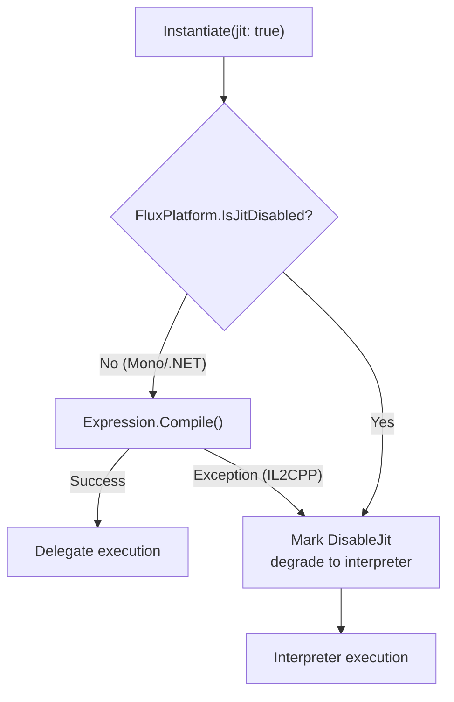

# Advanced Usage

## Connect: Chain Composition

`Connect()` no longer merges bytecode. It appends reference slices to `ChainLink[]` — zero bytecode copy, deferred materialization.

```
Connect(fA, fB):
  ChainLink[] = [Link(fA), Link(fB)]   // references only, no merge
```

At evaluation time, short chains (≤8) evaluate per-link through the R1 bus; long chains or JIT paths automatically merge to atomic. See [ChainLink Deep Dive](../technical/chainlink-deep-dive).

### Formula ↔ Modifier

`ToMultiplier()` replaces a Formula's first operand with R1 input (from previous link output). `ToFormula(name)` replaces a Modifier's R1 input with a named variable.

```csharp
var fA = Compile("x + y");                 // Formula
var fB = Compile("z * 2");                 // Formula

// ✅ B consumes A's output: convert to Modifier first
var chain = fA.Connect(fB.ToMultiplier());  // B's first operand from R1

// ❌ Connect rejects Formula — compile-time guard against implicit overwrite
// var chain2 = fA.Connect(fB);             // throws ArgumentException

// Round-trip preserves evaluation equivalence
var restored = fB.ToMultiplier().ToFormula("input");
restored.Set("input", 5f).Set("z", 3f).Run(); // equivalent to fB
```

### Chain Evaluation Paths

| Path | Chain ≤ MergeThreshold | Chain > MergeThreshold |
|------|----------------------|----------------------|
| Interpreter | Per-link Compute (R1 chaining) | ToAtomic merge → single Compute |
| JIT | Per-link delegates (`RunJitChain`) | Per-link delegates (`RunJitChain`) |

The JIT path compiles each link into an independent delegate, chained via `SetIndex(0, prevResult)`. The interpreter uses per-link evaluation for short chains (avoiding merge allocations) and merges long chains into contiguous bytecode for a single Compute (reducing loop overhead). The merge threshold is configurable via `FluxConfig.MergeThreshold` (default 8).

## Set: Named Variable Injection

Define variable patterns via the Lexer at compile time. Inject values by name at runtime. All variables with the same name are written. `Set()` uses an inline binary search to locate variable slots, zero GC. Throws `ArgumentException` if the name was not defined in `VariablePatterns`.

```csharp
var config = new LexerConfig<float, FloatOp>
{
    LiteralOper = FloatOp.Const,
    LiteralParser = s => float.Parse(s, CultureInfo.InvariantCulture),
    Operators = { new("+", FloatOp.Add), new("*", FloatOp.Mul) },
    VariablePatterns = { new("[", "]") },
    ImplicitOperators = { FloatOp.Mul },
};

var lexer = new FluxLexer<float, FloatOp>(config);
var lexResult = lexer.Lex("[atk] * 2 + [bonus]");

var formula = runner.Compile(lexResult);
var inst = runner.Instantiate(formula);

float r1 = inst.Set("atk", 150f).Set("bonus", 25f).Run();  // 325
float r2 = inst.Set("atk", 100f).Set("bonus", 50f).Run();  // 250
```

### SetIndex: Injection by Position

Inject values by Immediate slot index when variable names are not used:

```csharp
var formula = runner.Compile(new[] {
    C(0f), Op(FloatOp.Add), C(0f)  // 0 + 0 template
});

var inst = runner.Instantiate(formula);
float r = inst.SetIndex(0, 10f).SetIndex(1, 20f).Run();  // = 30
```

The JIT path uses the same injection approach, but data is written to a separate payload array rather than the formula buffer.

## JIT vs Interpreter: Selection Strategy



| Scenario | Recommendation |
|------|------|
| Unity Editor development | JIT (faster after compilation) |
| IL2CPP builds (iOS/WebGL/Console) | Interpreter (auto-degrade, no manual configuration) |
| Formula executed far more often than compiled | JIT (compile once, invoke repeatedly) |
| Formula rebuilt frequently | Interpreter (no compilation overhead) |

## Delegate Caching

FluxFormula includes built-in JIT delegate caching. The first `Instantiate(formula, jit: true)` call compiles and stores the delegate; subsequent instantiations of the same formula reuse it:

```csharp
var runner = new FluxAssembler<float, FloatOp, FloatMathDef>(Def);
var f = runner.Compile(lexer.Lex("2 + 3"));

// First: JIT compile → delegate stored in global cache
var r1 = runner.Instantiate(f, jit: true).Run(); // 5

// Second: cache hit, zero compilation
var r2 = runner.Instantiate(f, jit: true).Run(); // 5
```

The cache backend `IFluxCacheProvider` defaults to `FormulaCache` (slot count controlled by `FluxConfig.FormulaCacheCapacity`, default 2048). Replace it by implementing `TryGet`/`Put`/`TryGetDelegate`/`PutDelegate`. See [Compile Cache Pipeline](../technical/compile-cache). Other configurable parameters (`MergeThreshold`, `ConnectBufferSize`) are managed through `FluxConfig`.

## Persistence: ToBytes / FromBytes

```csharp
// Serialize
byte[] raw = formula.ToBytes();
File.WriteAllBytes("damage_formula.ff", raw);

// Deserialize (zero compilation)
var loaded = FluxFormula<float, FloatOp>.FromBytes(raw);
float r = runner.Instantiate(loaded).Set("atk", 100f).Run();
```

Bytecode is written directly to file — no JSON/XML serialization needed. For iOS hot-update scenarios: replace the `.ff` file to update formulas without triggering JIT, passing Apple review.
