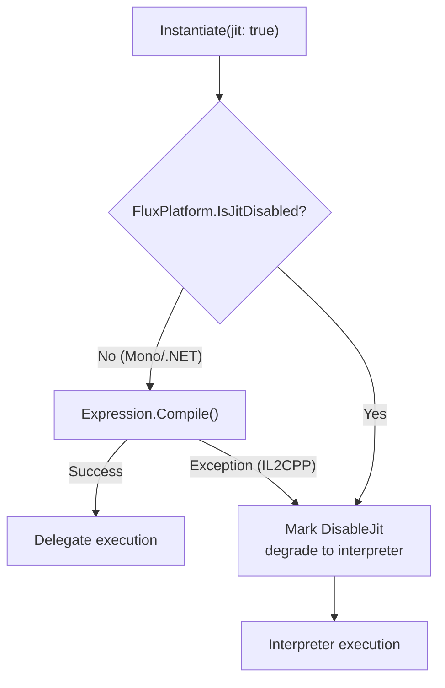

# Advanced Usage

Connect lets you chain formula fragments together — append a Modifier after a Formula, and the R1 bus carries context between them automatically. Set/SetIndex let you inject variables by name or slot index: compile once, reuse many times.

## Connect: Chain Composition

`Connect()` does not merge bytecode. It appends reference slices to `ChainLink[]` — zero bytecode copy, deferred materialization.

```
Connect(fA, fB):
  ChainLink[] = [Link(fA), Link(fB)]   // references only, no merge
```

At evaluation time, short chains (≤8) evaluate per-link through the R1 bus; long chains or JIT paths automatically merge to atomic. See [ChainLink Deep Dive](../technical/chainlink-deep-dive).

### Formula ↔ Modifier

`ToModifier()` replaces a Formula's first operand with R1 input (from previous link output). `ToFormula(name)` replaces a Modifier's R1 input with a named variable.

```csharp
var fA = Compile("x + y");                 // Formula
var fB = Compile("z * 2");                 // Formula

// ✅ B consumes A's output: convert to Modifier first
var chain = fA.Connect(fB.ToModifier());    // B's first operand from R1

// ❌ Compile error: Connect only accepts FluxModifier
// var chain2 = fA.Connect(fB);             // CS1503

// Round-trip preserves evaluation equivalence
var restored = fB.ToModifier().ToFormula("input");
restored.Set("input", 5f).Set("z", 3f).Run(); // equivalent to fB
```

### Chain Evaluation Paths

| Path | Chain ≤ MergeThreshold | Chain > MergeThreshold |
|------|----------------------|----------------------|
| Interpreter | Per-link Compute (R1 chaining) | ToAtomic merge → single Compute |
| JIT | Per-link delegates (`RunJitChain`) | Per-link delegates (`RunJitChain`) |

## Set: Named Variable Injection

Define variable patterns via the Lexer at compile time. Inject values by name at runtime.

```csharp
var config = new LexerConfig<float>
{
    LiteralOper = (byte)MathOp.Const,
    LiteralScanner = LexerConfig<float>.CreateDefaultNumberScanner(s => float.Parse(s, CultureInfo.InvariantCulture)),
    Operators = { new("+", (byte)MathOp.Add), new("*", (byte)MathOp.Mul) },
    VariablePatterns = { new("[", "]") },
    ImplicitOperators = { (byte)MathOp.Mul },
};

var lexer = new FluxLexer<float>(config);
var lexResult = lexer.Lex("[atk] * 2 + [bonus]");

var formula = runner.Compile(lexResult);
var inst = runner.Instantiate(formula);

float r1 = inst.Set("atk", 150f).Set("bonus", 25f).Run();  // 325
float r2 = inst.Set("atk", 100f).Set("bonus", 50f).Run();  // 250
```

## JIT vs Interpreter: Selection Strategy



## Delegate Caching

The first `Instantiate(formula, jit: true)` call compiles and stores the delegate; subsequent instantiations reuse it:

```csharp
var runner = new FluxAssembler<float, MathDef>(Def);
var f = runner.Compile(lexer.Lex("2 + 3"));

// First: JIT compile → delegate stored in global cache
var r1 = runner.Instantiate(f, jit: true).Run(); // 5

// Second: cache hit, zero compilation
var r2 = runner.Instantiate(f, jit: true).Run(); // 5
```

## Persistence: ToBytes / FromBytes

```csharp
// Serialize
byte[] raw = formula.ToBytes();
File.WriteAllBytes("damage_formula.ff", raw);

// Deserialize (zero compilation)
var loaded = FluxFormula<float, MathDef>.FromBytes(raw);
float r = runner.Instantiate(loaded).Set("atk", 100f).Run();
```

## Persisting Chain Formulas as VFF

```csharp
FluxChain<float, MathDef> chain = damageFormula.Connect(critModifier).Connect(elementModifier);

var links = chain.GetLinks();
byte[] vffData = VffFormat.ToBytes<float>(
    links.ToArray(),
    Array.Empty<VffOverride<float>>());

var formatter = new FileFluxFileFormatter();
formatter.Save(vffData, FluxArtifactKind.Virtual, "DamagePipeline");

// At runtime: load → resolve → execute
var result = VffFormat.FromBytes<float, MathDef>(vffData);
float damage = assembler.Instantiate(result.Chain)
    .Set("atk", 100f).Set("def", 50f).Run();
```

See [VffFormat API](../api/vff-format) for the complete VFF encoding/decoding reference.
