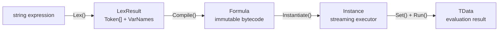
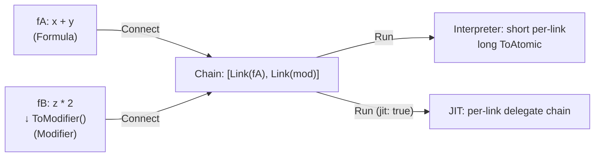

# Core Concepts

FluxFormula's compilation pipeline and key data structures (v3.0.0).

## Pipeline



### Lexer

`FluxLexer<TData>` parses string expressions into token streams. A hand-written `ReadOnlySpan<char>` scanner — zero regex, zero allocation.

Configuration:

- **Operators**: Symbol-to-opcode mappings (`"+" → (byte)MathOp.Add`, `"*" → (byte)MathOp.Mul`)
- **Brackets**: Bracket pair mappings (`"(" ")" → LParen, RParen`)
- **VariablePatterns**: Variable prefix/suffix patterns (`"[" "]"` recognizes `[atk]`)
- **ImplicitOperators**: Default operators for implicit multiplication (`2[atk]` → `2*[atk]`)
- **LiteralOper / LiteralScanner**: Numeric literal opcode and parser

Produces `LexResult<TData>`, containing a token array and variable name array.

### TokenContext: Contextual Disambiguation

When the lexer encounters a symbol (e.g., `-`), it cannot determine whether an operand or operator is expected. `ResolveToken(byte oper, TokenContext)` performs secondary disambiguation during compilation:

| TokenContext | Trigger condition |
|---|---|
| `OperandExpected` | Expression start, after left parenthesis, after binary operator |
| `OperatorExpected` | After operand, after right parenthesis |

```csharp
// '-' is unary negation when operand expected, binary subtraction otherwise
public byte ResolveToken(byte oper, TokenContext ctx)
{
    if (oper == (byte)MathOp.Sub && ctx == TokenContext.OperandExpected)
        return (byte)MathOp.Neg;
    return oper;
}
```

### Token (Lexical Layer)

`FluxToken<TData>` is the atomic building block of infix expressions. Each token consists of `Oper` (`byte` opcode) and `Data` (data value).

- **Immediate Token**: Carries a concrete value (e.g., `Const + 42f`)
- **Operator Token**: Represents an operator (e.g., `Add`, `Neg`), with `Data` as `default`
- **Pair Token**: Represents brackets (e.g., `LParen`, `RParen`)

### Formula / Modifier (Compilation Output)

`FluxFormula<TData, TDef>` and `FluxModifier<TData, TDef>` are immutable bytecode containers. Generated by `FluxAssembler.Compile()`, cacheable and reusable.

- **Formula** (complete): Can be `Instantiate`d and `Run` standalone
- **Modifier** (missing left operand): Can only be attached behind a Formula via `Connect()`, or converted via `ToFormula(varName)`. Has no `Instantiate()` method — compile-time guarantee.

### Instance (Executor)

`FluxInstance<TData, TDef>` is a ref struct streaming executor. Stack-allocated, non-boxable, zero GC.

## Formula vs Modifier: Type-Level Distinction

In v3.0.0, `FluxFormula` and `FluxModifier` are two distinct types — the distinction is in the **type system** rather than a runtime tag (the internal `FluxType` enum is now `internal`):

| Type | First Token | Can Instantiate? | Purpose |
|------|-------------|:---:|------|
| `FluxFormula<TData, TDef>` | Const, unary prefix, or left paren | Yes | Complete formula, evaluable directly |
| `FluxModifier<TData, TDef>` | Binary operator (e.g., `+`) | **Won't compile** | Fragment; requires `Connect()` to a Formula |

```csharp
var f42 = runner.Compile(new[] { C(42f) });                        // FluxFormula
var mod = runner.Compile(new[] { Op((byte)MathOp.Add), C(5f) });   // FluxModifier

// Compile-time type safety: Connect only accepts FluxModifier
var combined = f42.Connect(mod);  // 42 + 5, compiles fine
// f42.Connect(someFormula) → CS1503, cannot convert FluxFormula to FluxModifier
```

## Instruction Layout

8-byte fixed-size struct, explicit memory layout (`LayoutKind.Explicit`):

| Byte offset | 0 | 1 | 2 | 3 | 4 | 5 | 6 | 7 |
|-------------|---|---|---|---|---|---|---|---|
| **Field** | OpCode | Dest | Arg0 | Arg1 | Arg2 | Arg3 | Arg4 | Arg5 |

- **OpCode**: `byte` opcode
- **Dest**: Result destination register number
- **Arg0-Arg5**: Operand register numbers, max arity = 6

## Register Model

256 virtual registers (addressable by byte):

| Constant | Register | Semantics |
|----------|----------|-----------|
| `Registers.Error = 0` | R0 | Error register. Non-default value triggers early exit |
| `Registers.Bus = 1` | R1 | Bus register / default result |
| `Registers.FirstAlloc = 2` | R2-R254 | General-purpose registers, allocated incrementally |

## Chain Connect: Deferred Materialization

`Connect()` does not merge bytecode — each call appends a `ChainLink` (a reference slice to the original formula's bytecode):



**ChainLink fields** (public struct, accessible via `FluxChain.GetLinks()`):

| Field | Description |
|-------|-------------|
| `Key` | `DualHash64` of the fragment — cache lookup key |
| `Bytecode` | Reference to original `Instruction[]` (not copied) |
| `InstructionCount` | Number of instructions |
| `Type` | Internal `FluxType` (Formula or Modifier) |

## Formula ↔ Modifier Conversion

`ToModifier()` removes the first data operand and renames its register references to R1. `ToFormula(varName)` inserts a named variable in place of R1 input.

```csharp
var f = Compile("x + y");           // FluxFormula

var m = f.ToModifier();             // FluxModifier — no Instantiate()
// m cannot run standalone — won't compile

var restored = m.ToFormula("input"); // FluxFormula — evaluable now
restored.Set("input", 5f).Run();     // works
```

> v3.0.0: `Connect` signature only accepts `FluxModifier<TData, TDef>`. Passing `FluxFormula` won't compile — no runtime `ArgumentException` needed.

## Delegate Caching

JIT-compiled delegates are cached in `FormulaCache`, keyed by `DualHash64`. Same formula compiles only once regardless of instantiation count. Auto-degrades to interpreter on IL2CPP/AOT platforms.

## Interpreter vs JIT

| | Interpreter | JIT |
|------|------|------|
| Mechanism | `stackalloc` registers + pointer loop | LINQ Expression Tree → `Compile()` delegate |
| AOT platforms | Available | Auto-degrades to interpreter |
| Selection | `Instantiate(jit: false)` | `Instantiate(jit: true)` |
