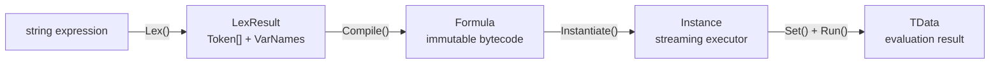
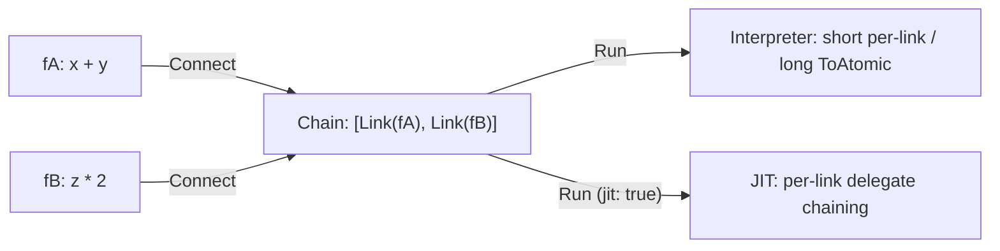

# Core Concepts

FluxFormula's compilation pipeline and key data structures.

## Pipeline



### Lexer

`FluxLexer<TData, TOper>` parses string expressions into token streams. A hand-written `ReadOnlySpan<char>` scanner — zero regex, zero allocation.

Configuration:

- **Operators**: Symbol-to-enum mappings (`"+" → Add`, `"*" → Mul`)
- **Brackets**: Bracket pair mappings (`"(" ")" → LParen, RParen`)
- **VariablePatterns**: Variable prefix/suffix patterns (`"[" "]"` recognizes `[atk]`)
- **ImplicitOperators**: Default operators for implicit multiplication (`2[atk]` → `2*[atk]`)
- **LiteralOper / LiteralParser**: Numeric literal operator and parser

Produces `LexResult<TData, TOper>`, containing a token array and variable name array.

### TokenContext: Contextual Disambiguation

When the lexer encounters a symbol (e.g., `-`), it cannot determine whether an operand or operator is expected. `ResolveToken(TOper, TokenContext)` performs secondary disambiguation during compilation based on context:

| TokenContext | Trigger condition |
|---|---|
| `OperandExpected` | Expression start, after left parenthesis, after binary operator |
| `OperatorExpected` | After operand, after right parenthesis |

```csharp
// '-' is unary negation when operand expected, binary subtraction otherwise
public FloatOp ResolveToken(FloatOp op, TokenContext ctx)
{
    if (op == FloatOp.Sub && ctx == TokenContext.OperandExpected)
        return FloatOp.Neg;
    return op;
}
```

### Token (Lexical Layer)

`FluxToken<TData, TOper>` is the atomic building block of infix expressions. Each token consists of `Oper` (operator enum) and `Data` (data value).

- **Immediate Token**: Carries a concrete value (e.g., `Const + 42f`)
- **Operator Token**: Represents an operator (e.g., `Add`, `Neg`), with `Data` as `default`
- **Pair Token**: Represents brackets (e.g., `LParen`, `RParen`)

### Formula (Compilation Output)

`FluxFormula<TData, TOper>` is an immutable bytecode container holding an `Instruction[]` buffer. Generated by `FluxAssembler.Compile()`, cacheable and reusable. Key fields:

- `Count`: Number of instructions (including trailing Return)
- `ImmediateCount`: Number of immediate slots
- `VariableSlots`: Variable name to slot index mapping

### Instance (Executor)

`FluxInstance<TData, TOper, TDef>` is a ref struct streaming executor. Stack-allocated, non-boxable, zero GC.

## FluxType: Formula vs Modifier

| Type | First Token | Can Run? | Purpose |
|------|-------------|:---:|------|
| `Formula` | Const, unary prefix, or left paren | Yes | Complete formula, evaluable directly |
| `Modifier` | Binary operator (e.g., `+`) | No | Fragment missing left operand; requires `Connect()` to a Formula |

```csharp
var f42 = runner.Compile(new[] { C(42f) });                   // Formula
var mod = runner.Compile(new[] { Op(FloatOp.Add), C(5f) });   // Modifier, cannot Run

// Correct usage: connect
var combined = f42.Connect(mod);  // 42 + 5
```

## Instruction Layout

8-byte fixed-size struct, explicit memory layout (`LayoutKind.Explicit`):

| Byte offset | 0 | 1 | 2 | 3 | 4 | 5 | 6 | 7 |
|-------------|---|---|---|---|---|---|---|---|
| **Field** | OpCode | Dest | Arg0 | Arg1 | Arg2 | Arg3 | Arg4 | Arg5 |
| **Overlay** | ← ← ← ← Raw (long) → → → → ||||||

- **OpCode**: Operator's underlying byte (`*(byte*)&enumValue`)
- **Dest**: Result destination register number
- **Arg0-Arg5**: Operand register numbers, max arity = 6
- **Raw**: Full 8-byte long view, sharing offset 0 with OpCode; for debugging

## Register Model

256 virtual registers (addressable by byte), with semantic constants centralized in the `Registers` class:

| Constant | Register | Semantics |
|----------|----------|-----------|
| `Registers.Error = 0` | R0 | Error register. Any operation may write a non-default value to trigger early exit. R0 is checked after each instruction; if non-default, execution terminates immediately |
| `Registers.Bus = 1` | R1 | Bus register / default result. Binary operation results are typically written to R1. When no error occurs, the final result is obtained from the Return instruction's destination register |
| `Registers.FirstAlloc = 2` | R2-R254 | General-purpose registers. Allocated incrementally by the compiler, never reused. Upper limit constrained by `Registers.Max = 255` |

Runtime allocation can be reduced per-formula via the `MaxRegister` header field (auto-analyzed at compile time) — a formula using only R0–R5 allocates 6 slots instead of the full 256.

### Three OpTypes

| Type | Behavior |
|------|----------|
| `Immediate` | Embeds Token.Data into the instruction buffer; loaded into target register at runtime |
| `Instruction` | Reads operands from registers, invokes `Compute()` or JIT Expression, writes result to Dest register |
| `Return` | Terminates execution. Returns the value in the destination register (if no error) or R0 (if error) |

## Chain Connect: Deferred Materialization

`Connect()` no longer merges bytecode. Each call appends a `ChainLink` — a reference slice to the original formula's bytecode — without allocating a new `Instruction[]`.



This mirrors LINQ's deferred execution: `Where().Select()` builds iterator decorators; `foreach` / `ToList()` materializes. Chain Connect only appends references to `ChainLink[]`; physical bytecode merging is deferred to evaluation time.

**ChainLink fields:**

| Field | Description |
|-------|-------------|
| `Key` | `DualHash64` of the fragment — cache lookup key |
| `Bytecode` | Reference to original `Instruction[]` (not copied) |
| `InstructionCount` | Number of instructions |
| `Type` | `FluxType` (Formula or Modifier) |
| `ImmediateCount` | Number of immediate data slots |
| `VarSlots` | Variable slots for this fragment |
| `MaxRegister` | Compile-time max register index (0 = unanalyzed) |

## Delegate Caching

JIT-compiled delegates (`Expression.Compile()` → `Func<Instruction[], TData>`) are cached in `FormulaCache`, keyed by `DualHash64`.

```
Instantiate(formula, jit: true)
  ├─ GetByteHash() → FormulaCache.TryGetDelegate(hash)
  │    ├─ Hit → reuse cached delegate + rebuild payload
  │    └─ Miss → FluxJITCompiler.Compile() → GCHandle.Alloc → PutDelegate(hash)
  └─ Return FluxInstance
```

The same formula compiles only once regardless of how many times it is instantiated. On IL2CPP/AOT platforms where `Expression.Compile()` is unsupported, evaluation automatically degrades to the interpreter.

## Formula ↔ Modifier Conversion

Formula and Modifier are two views of the same bytecode. `ToMultiplier()` removes the first data operand and renames its register references to R1. `ToFormula(varName)` inserts a named variable in place of the R1 input.

```csharp
var f = Compile("x + y");           // Formula: Immediate(x)→R2, Immediate(y)→R3, Add R2,R3→R4

var m = f.ToMultiplier();           // Modifier: Immediate(y)→R3, Add R1,R3→R4
// m cannot Run standalone — missing left operand

var restored = m.ToFormula("input"); // Formula: Immediate(input)→RX, Immediate(y)→R3, Add RX,R3→R4
restored.Set("input", 5f).Set("y", 3f).Run(); // 8
```

Round-trip evaluation equivalence is maintained. The `CHAIN_LINK_INTERNAL_` prefix is reserved for internal variables; users must not declare variables with this prefix.

> `Connect` does not automatically call `ToMultiplier` on Formula arguments. To let B consume A's output, explicitly use `fA.Connect(fB.ToMultiplier())`.

## Interpreter vs JIT

| | Interpreter | JIT |
|------|------|------|
| Mechanism | `stackalloc` registers + `fixed` pointer loop | LINQ Expression Tree → `Compile()` delegate |
| First-run overhead | Zero | Yes (Expression compilation) |
| Execution speed | Instruction-by-instruction | Native delegate invocation after compilation |
| AOT platforms | Available | Unavailable on IL2CPP/iOS/WebGL; auto-degrades to interpreter |
| Selection | `Instantiate(jit: false)` | `Instantiate(jit: true)` |
