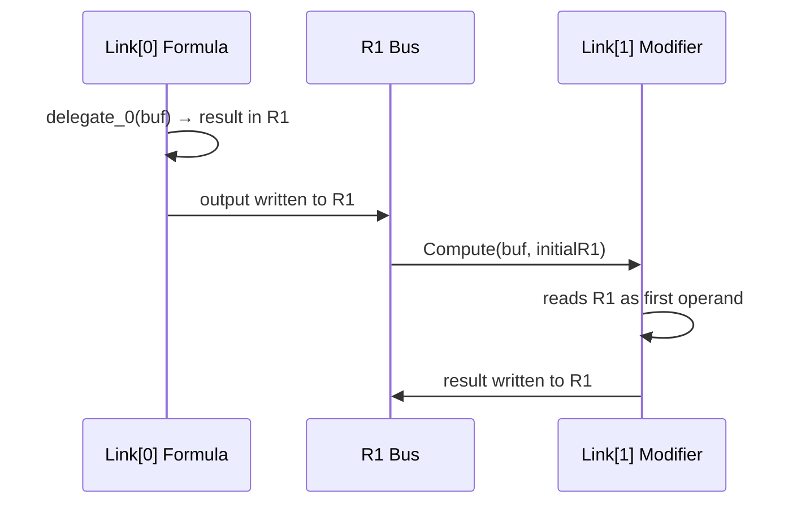

# ChainLink: How JIT Delegates Chain Correctly

ChainLink is not another "merge" strategy — it is the **rejection of merging**. This document explains why NOT merging is what makes JIT delegate caching possible.

## The Problem: Merging Invalidates Caches

Traditional `Connect` merges two formulas' bytecode into contiguous memory:

```
Connect(A, B):
  newBuffer = Copy(A.bytecode[..-1]) + Copy(B.bytecode)  // new allocation
  return new FluxFormula(newBuffer)
```

Each Connect produces a **new formula** — new bytecode, new hash, requiring new JIT compilation. Even if A's delegate and B's delegate are both cached, `Connect(A, B)` is a novel entity:

```
A's delegate → cached ✓
B's delegate → cached ✓
Connect(A, B)'s delegate → not cached, must JIT ✗
```

Worse: combinatorial explosion. N atomic formulas produce O(N²) possible Connect products. The same formula used as a Modifier in different chains generates a new merged bytecode each time.

## The Solution: Don't Merge

ChainLink stores **reference slices**, not data copies:

```csharp
struct ChainLink
{
    DualHash64   Key;              // Bytecode hash of this fragment
    Instruction[] Bytecode;        // Reference (points to original formula's _buffer)
    int          InstructionCount;
    FluxType     Type;             // Formula or Modifier
    int          ImmediateCount;   // Data slot count
    VariableSlot[] VarSlots;       // This fragment's variables
    byte         MaxRegister;      // Compile-time max register index (0 = unanalyzed)
}
```

`Bytecode` references the original formula's `Instruction[]` — zero additional allocation.

```
Connect(fA, fB):
  ChainLink[] = [Link(fA), Link(fB)]   // appends references only, zero bytecode copy
```

Back to caching: A's delegate and B's delegate are independently cached. No matter what order they appear in across any number of chains, every link in every chain hits the cache:

```
Chain 1: Connect(A, B)           → [Link(A), Link(B)]           → A.delegate + B.delegate (both hit)
Chain 2: Connect(C, B)           → [Link(C), Link(B)]           → C.delegate + B.delegate (both hit)
Chain 3: Connect(A.ToModifier, B.ToModifier) → [Link(A_mod), Link(B_mod)] → both hit
```

N formulas, O(N) delegates. Any chain combination evaluates using only already-cached delegates. Combinatorial explosion eliminated.

## Why Each Link Is Independently JIT-Compilable

The key constraint comes from FluxFormula's register model: **R0 = error sentinel, R1 = input/output bus, R2-R254 = temporaries**.

Each formula is compiled with independently allocated temporary registers (starting from R2). Two different formulas using the same register numbers (both using R2, R3) do not share register space — they execute in separate delegate/interpreter invocations.



Per-link evaluation guarantees correctness through two mechanisms:

### Interpreter Path

`FluxEvaluator.Compute(ReadOnlySpan<Instruction>)` executes each link's bytecode as an independent program. Non-first links use `Compute(span, initialR1)` — R1 is initialized to the previous link's output before execution begins. A Modifier's bytecode (transformed by `ToModifier`) has its first Immediate removed; its first instruction reads directly from R1.

### JIT Path

JIT requires contiguous bytecode. `ToAtomic` concatenates all links in full (no instructions dropped), including intermediate Returns. The interpreter handles intermediate Returns specially:

```
Return instruction followed by more instructions (ip + 1 < raw.Length)
  → Do not exit. Copy Dest register value to R1. Continue to next link.
```

In merged bytecode, each link's Return naturally serves as an "R1 bus write point", and the next link's instructions read from R1.

## The Role of Modifiers

A ChainLink can be a Formula or a Modifier. Formula starts from its own first operand; Modifier takes its first operand from R1 (the previous link's output).

`ToModifier()` implements this conversion at the bytecode level:

```
Formula "2 + 3":
  [Imm(2)→R2] [Imm(3)→R3] [Add R2,R3→R4] [Return R4]

ToModifier() → Modifier:
  [Imm(3)→R3] [Add R1,R3→R4] [Return R4]
   ↑ First operand supplied by R1; 2 removed; R2 renamed to 1
```

`ToFormula(varName)` performs the inverse: inserts a named variable in place of the R1 input.

ChainLink does not auto-convert — `Connect(A, B)` keeps B as-is. To let B consume A's output, explicitly use `Connect(A, B.ToModifier())`.

## ToAtomic: Chain → Atomic Merge

When a chain must become a single contiguous block of bytecode (long chain interpreter path, AOT fallback scenarios), `ToAtomic()` concatenates all links' `Instruction[]` arrays in full. The JIT path defaults to per-link delegates (`RunJitChain`) and does not trigger a merge.

```csharp
// Full concatenation — no instructions dropped
int totalCount = links[0].InstructionCount + links[1].InstructionCount + ...;
var merged = new Instruction[totalCount];
// Copy each link in full
```

The merged bytecode feeds directly into the JIT compiler or interpreter. Because the interpreter supports mid-program Return semantics, merged bytecode produces results identical to per-link evaluation.

## Performance Model

| Operation | Allocation | Notes |
|-----------|-----------|-------|
| `Connect(A, B)` | `ChainLink[2]` (tiny) | No unnecessary bytecode copy |
| `Run()` short chain (≤8) | Per link: `Instruction[]` copy | Evaluation only, not merging |
| `ToAtomic()` | Merged `Instruction[]` | Only triggered for JIT or very long chains |
| Delegate cache hit | Payload rebuild only | JIT compilation itself skipped |

## Reserved Variables

`ChainReserved.InternalPrefix = "CHAIN_LINK_INTERNAL_"` is reserved for chain evaluation internal variables. User-declared variables must not use this prefix.

## See Also

- [Core Concepts](../guide/core-concepts.md#chain-connect-deferred-materialization) — Chain Connect overview
- [Compile Cache Pipeline](./compile-cache.md) — Full DualHash ↔ FormulaCache ↔ Delegate pipeline
- [Architecture Decisions](./architecture-decisions.md) — ADR-3 (Deferred Materialization), ADR-6 (Mid-Program Return)
