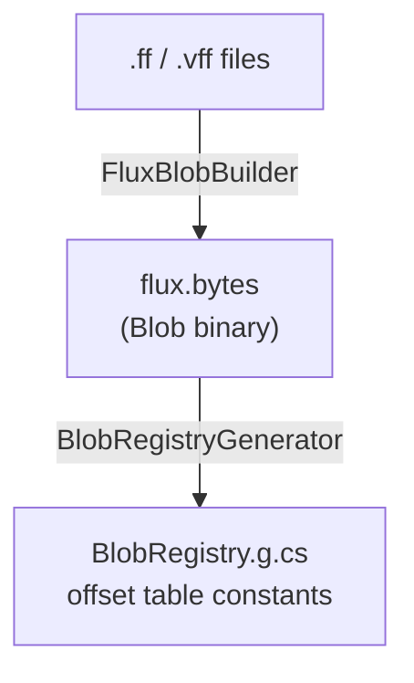
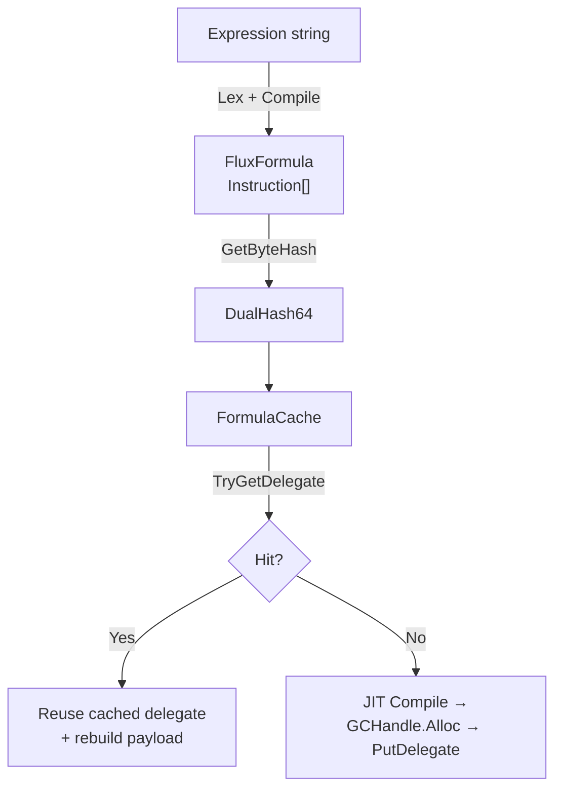
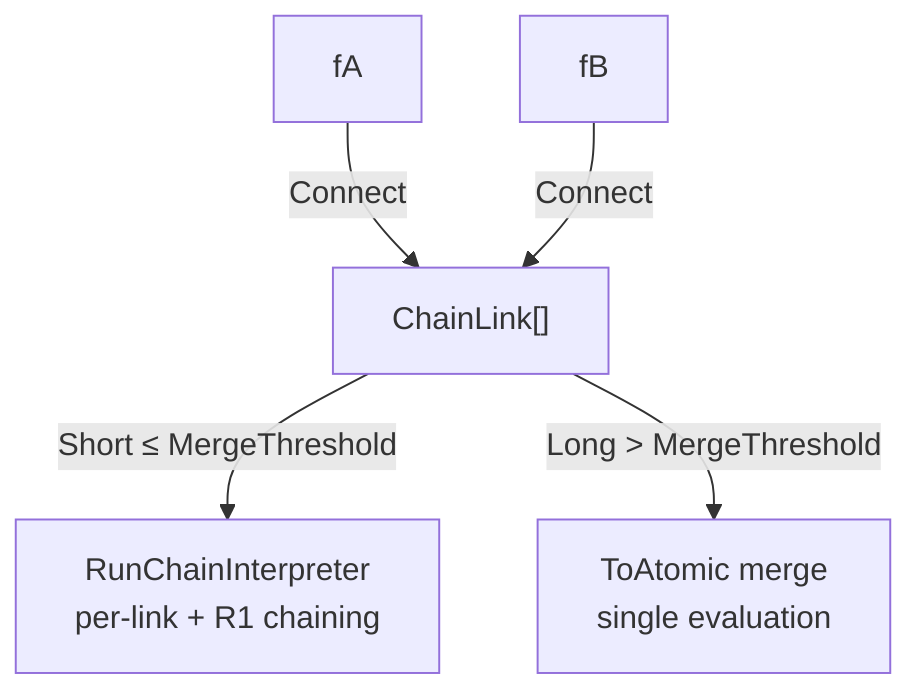

# Compile Cache Pipeline

Full-chain architecture: formula bytecode hashing, caching, chain composition, and JIT delegate caching.

## Architecture Overview

**Offline** — formula compilation to bytecode, Source Generator produces the offset table:



**Runtime** — Lex → Compile → cache query → JIT/reuse:



**Connect** — chain composition and evaluation strategy:



## Dual Hash Design

`DualHash64` combines two non-cryptographic hashes: **xxHash64** (upper 64 bits) + **FNV-1a 64** (lower 64 bits).

### Why Two Hashes

A single non-cryptographic 64-bit hash has a collision space of roughly 2³² under birthday attack. An attacker familiar with the hash's internal state can construct structural collisions by exploiting algebraic weaknesses.

Two hashes with independent internal structures force the attacker to solve simultaneous equations: find a byte sequence that collides under both xxHash64 and FNV-1a 64 simultaneously. Since their algebraic weaknesses do not overlap (xxHash relies on multiply-shuffle-rotate; FNV on XOR-prime-multiply), the joint collision problem is practically intractable for non-cryptographic hashes.

### Storage Strategy

Hashes are read by `BlobRegistryGenerator` (Source Generator) at compile time from the `.bytes` file header and entry table, then emitted as compiled offset-table constants in the assembly:

```
BlobRegistry.g.cs (in assembly)        flux.bytes (data file)
  BlobEntry { hash, offset_0, len_0 } → [bytecode_A raw bytes]
  BlobEntry { hash, offset_1, len_1 } → [bytecode_B raw bytes]
```

Tampering with the `.bytes` file also requires modifying the compiled IL, which requires decompilation and recompilation of the assembly. At runtime, the offset table is obtained via `IFluxBlobRegistry.GetEntries()`; `FluxBlob.Load()` uses `BlobEntry.Offset` to index bytecode directly from the pinned blob data.

### xxHash64 Implementation

32-byte stripe processing with four parallel accumulators. Cross-validated against .NET 9 `System.IO.Hashing.XxHash64` for all lengths 0–256+ bytes.

### FNV-1a 64 Implementation

Byte-by-byte XOR-then-multiply-by-prime. ~10 lines. Empty-string basis `0xCBF29CE484222325` matches the FNV specification.

### Combine: Chain Key Computation

`DualHash64.Combine(a, b)` performs O(1) algebraic mixing of two hashes without re-scanning the byte sequence:

```
key(Connect(A, B))   = Combine(hash(A), hash(B))
key(Connect(A, B, C)) = Combine(Combine(hash(A), hash(B)), hash(C))

Combine(A, B) ≠ Combine(B, A)  // order-sensitive
```

## FormulaCache

Open-addressing hashmap (default 256 slots, adjustable via `FluxConfig.FormulaCacheCapacity`). Zero linked-list pointers. Zero GC allocation after construction.

### Storage Structure

```
_xxHashKeys[capacity]   ulong[]    DualHash64.XxHash64 component
_fnvHashKeys[capacity]  ulong[]    DualHash64.FnvHash64 component
_valuePtrs[capacity]    IntPtr[]   bytecode pointer or GCHandle handle
_valueLengths[capacity] int[]      state marker + length
```

### Slot States

| Value | Meaning |
|-------|---------|
| ≥ 0 | Bytecode entry (value = byte length) |
| -1 (Empty) | Never written |
| -2 (DelegateSlot) | JIT delegate entry |
| -3 (Tombstone) | Evicted entry |

### Probing and Eviction

- **Linear probe**: `hash(key.XxHash64) % Capacity` → step until match or empty
- **Tombstones do not break chains**: evicted slots are marked Tombstone, not Empty, so entries further down the probe chain remain reachable
- **Ring eviction**: `_ringHead` pointer advances on each insert; when full, overwrites the oldest
- **Compact**: when tombstone count exceeds `Capacity/4`, full-table rehash eliminates fragmentation

### GCHandle Lifecycle

Delegates are stored via `GCHandle.Alloc(func)` → `GCHandle.ToIntPtr()`. Eviction or Compact automatically calls `GCHandle.Free()`. Bytecode pointers are held by blob (pre-compiled) or the formula's own `Instruction[]` (runtime `Raw()` fallback), with no intermediate layer.

## FormulaCache Static Singleton

All cache operations go through `FormulaCache.Instance`, the global singleton.

Pre-compiled formulas are registered by `FluxBlob.Load()`: bytecode pointers come directly from the pinned blob data array, zero-copy into `FormulaCache`. Compressed entries are auto-decompressed by `FluxBlob.Load()` into separate pinned arrays. `FluxBlob.Unload()` calls `FormulaCache.Remove()` per key to release resources.

Runtime JIT delegates are cached via `PutDelegate` after compilation. `PutBytes` provides an owned-memory write path — the cache takes over GCHandle lifecycle, auto-freeing on eviction, overwrite, or compact.

ConnectCache (the former 1 MB pinned buffer intermediate copy layer) has been removed — the blob pipeline made runtime bytecode staging unnecessary.

## Chain Connect

### ChainLink

An immutable slice of a formula's bytecode. Retains a reference to the original `Instruction[]` (no copy) plus per-fragment metadata.

### Connect Strategy

`Connect` always produces chains — no length check, no bytecode merge. The merge decision is centralized in `Instantiate`:

| Path | Chain ≤ 8 | Chain > 8 |
|------|-----------|-----------|
| JIT | Per-link delegate (`InstantiateJitChain`) | Per-link delegate (`InstantiateJitChain`) |
| Interpreter | Per-link `Compute(span, initialR1)` | `ToAtomic()` merge → single `Compute` |

### Chain Interpreter Evaluation

`RunChainInterpreter` evaluates links sequentially, chaining results through the R1 bus:

```
result = kernel.Compute(link0.bytecode)                       // R1 = 0
result = kernel.Compute(link1.bytecode, initialR1: result)    // R1 = previous
result = kernel.Compute(link2.bytecode, initialR1: result)
...
```

Each link gets a temporary `Instruction[]` copy with variable values injected via `FluxInjector.GetValue()` (O(1) readback).

## JIT Delegate Caching

### Cache Key

Each formula's delegate is keyed by `GetByteHash()`:
- Atomic formula: `DualHash64` of `ToBytes()`
- Chain formula: sequential `Combine` of all link keys

### Flow

`FluxAssembler.Instantiate(formula, jit: true)`:

1. Chain formula → per-link JIT chain via `InstantiateJitChain()`
2. `GetByteHash()` → `FormulaCache.TryGetDelegate(hash)`
3. Hit: `GCHandle.FromIntPtr` → cast to `CompiledFunc` → `CreateJitPayload` rebuild → return
4. Miss: `FluxExprCompiler.Compile()` → `GCHandle.Alloc(func)` → `PutDelegate(hash, handle)` → return

### Payload Rebuilding

On cache hit, the caller does not hold the original `payload[]` (produced by `Compile`). `CreateJitPayload` reconstructs the compact data array from `formula.Raw()`, producing output identical to `Compile`'s.

## Platform Verification

| Platform | Interpreter | JIT | Delegate Cache |
|----------|:---:|:---:|:---:|
| .NET 9 (test) | ✅ | ✅ | ✅ |
| Unity 2021.3 (Mono) | Expected ✅ | Expected ✅ | Expected ✅ |
| Unity 2022.3+ | Expected ✅ | Expected ✅ | Expected ✅ |
| Unity 6 (CoreCLR) | Expected ✅ | Expected ✅ | Expected ✅ |
| IL2CPP / AOT | ✅ | Degraded | N/A after degradation |
