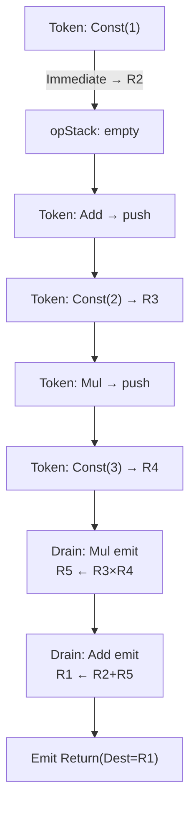
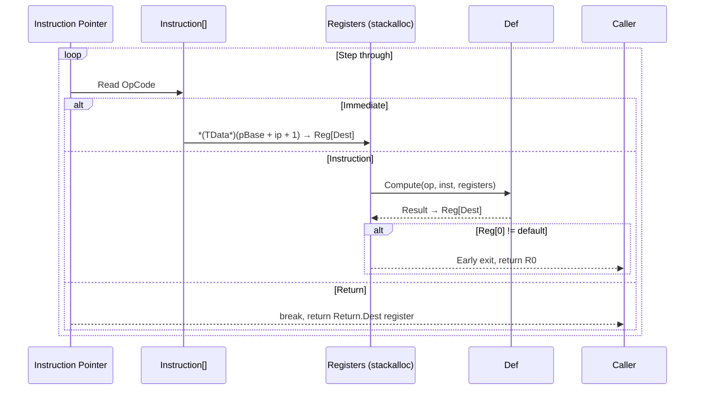

# Internals

This page is condensed from `docs/technical-analysis.md`. See that file for a complete line-by-line analysis.

## Compilation Pipeline: Shunting-Yard Algorithm

`FluxCompiler` implements the standard shunting-yard algorithm to convert infix tokens to postfix bytecode:

1. Iterate over the token sequence
2. Disambiguate each token by context: `ResolveToken(op, TokenContext)` maps the same symbol to different operators (e.g., `-` → unary negation vs. binary subtraction)
3. Immediate → allocate a register, embed data into the instruction buffer
4. Operator → decide whether to pop the operator stack based on precedence and associativity
5. Left bracket → push; right bracket → pop until match
6. End of iteration → pop remaining operators → append Return instruction



## Interpreter Execution Loop



## JIT Compilation Process

1. Scan bytecode, extract Immediate data into `payload[]` (compact data array)
2. Create 256 `ParameterExpression` instances as register variables
3. Generate LINQ Expressions per instruction:
   - Immediate → `SafeCast(payload, index)` to read from the data array
   - Instruction → `GetExpression()` + assignment + R0 error check
   - Return → conditional expression (R0 non-default ? R0 : Dest)
4. `Expression.Lambda.Compile()` → `Func<Instruction[], TData>` delegate

## Data Injection Mechanism

`FluxInjector` overwrites data slots in `Instruction[]` via `fixed` pointers:

```csharp
fixed (Instruction* pBase = _buffer)
{
    *(TData*)(pBase + offset) = value;  // Pointer reinterpretation, zero-copy write
}
```

- Interpreter path: offsets pre-computed by `CreateInjector()` via a two-pass scan
- JIT path: linear index `index * slotsPerData`

## Platform Compatibility

| Platform | Scripting Backend | JIT | Interpreter |
|------|----------|:---:|:---:|
| Windows/macOS/Linux (Editor) | Mono | Available | Available |
| Windows/macOS/Linux (Player) | Mono | Available | Available |
| iOS/WebGL/Console | IL2CPP | Auto-degrade | Available |
| Android | IL2CPP | Auto-degrade | Available |

`FluxPlatform.DisableJit()` is called automatically when the first `Expression.Compile()` fails; subsequent instantiations skip JIT attempts.
