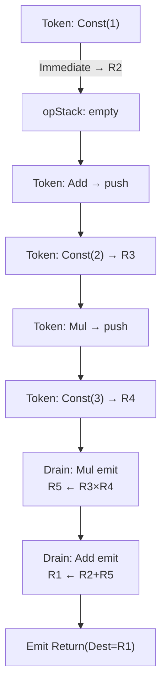
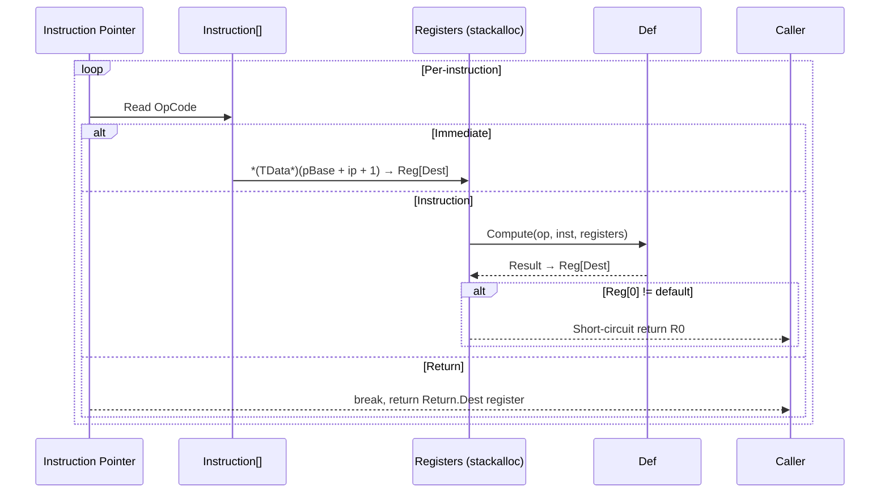

# Internals

This document is a quick reference for FluxFormula's core internals. For a complete line-by-line analysis, see [Source Technical Analysis](./technical-analysis.md). For the architectural decision chronicle, see [Architecture Decisions](./architecture-decisions.md).

## Compilation Pipeline: Shunting-Yard

`FluxCompiler` implements the shunting-yard algorithm to convert infix tokens to postfix bytecode:

1. Iterate the token sequence
2. Disambiguate each token by context: `ResolveToken(op, TokenContext)` maps the same symbol to different operators (e.g., `-` mapped to unary negation vs binary subtraction)
3. Immediate: allocate register, embed data into instruction buffer
4. Operator: decide whether to pop the operator stack based on precedence and associativity
5. Left parenthesis: push; right parenthesis: pop until match
6. End of traversal: pop remaining operators, append Return instruction

The `MaxRegister` field in the formula header (byte 14) records the maximum register index actually used, enabling on-demand `stackalloc` rather than full 255.



See [Shunting-Yard Compiler](./pipeline/compiler.md).

## Interpreter Execution Loop



Register model: R0 = Error (short-circuit return), R1 = Bus (chain formula output bus), R2-R254 = general purpose, Max = 255.

See [Interpreter Execution Loop](./pipeline/evaluator.md).

## JIT Compilation: Dual Backend

### Expression Tree Compilation (Universal Path)

`FluxExprCompiler` builds a `ParameterExpression[]` register file, generates LINQ Expressions per instruction, and compiles to a `CompiledFunc<TData>` delegate. Cross-platform compatible (works on IL2CPP/AOT). Supports `FastExpressionCompiler` optimization.

### IL Emission Compilation (Custom Path)

`FluxILCompiler` uses `DynamicMethod` + `ILGenerator` to directly emit IL bytecode, bypassing Expression Tree AST construction overhead. Two-tier inlining architecture:

- **Tier A**: calls `IFluxDefinition<TData>.Compute` pointer overload via `callvirt`
- **Tier B**: if `TDef` implements `IFluxILDefinition`, delegates to `EmitOp` for hand-written IL emission (zero virtual call overhead)

Three-tier degradation chain: IL (fastest, Mono/CoreCLR only) → Expression Tree (universal) → Interpreter (fallback). `FluxPlatform` performs a one-time capability detection at runtime and globally degrades.

See [IL Compiler](./pipeline/il-compiler.md) and [Expression Tree Compilation](./pipeline/jit.md).

## Three Evaluator States

Three evaluators share the same register machine execution core (`while (ip < instrCount)` loop, three-way dispatch Immediate/Instruction/Return), differing only in suspension strategy:

| Evaluator | Suspension Unit | State Model | Purpose |
|-----------|----------------|-------------|---------|
| `FluxEvaluator` (ref struct) | None, full speed | stackalloc, mutable | Production hot path |
| `FluxCurryEvaluator` | Between Immediate variables | Heap arrays, functional State→State | Gradual parameter binding |
| `FluxStepEvaluator` | Every instruction | Heap arrays, functional State→State | Per-instruction debugging/visualization |

See [Curry Evaluator](./pipeline/curry-evaluator.md).

## Dual-Path Data Injection

The variable value write path depends on the execution backend:

- **FluxJITInjector** (JIT hot path): 2 fields (`_buffer` + `_slotsPerData`), zero-branch `SetIndex`. JIT delegates pass the injector as a value type on the call stack, zero GC.
- **FluxInjector** (interpreter / chain JIT): 11 fields, including parallel arrays `_varNames[]` + `_varSlotIndexes[][]` for inline binary search by-name injection. `_values[]` array provides O(1) value readback for chain evaluation. `TrySet` provides silent injection for VFF override scenarios.

See [Data Injector](./pipeline/injector.md) and [JIT Injector](./pipeline/jit-injector.md).

## LiteralScanner Source Generator Pipeline

Generates dedicated literal scanners at compile time from attribute declarations, replacing runtime reflection and hand-written delegates:

```
[LiteralTag] [LiteralTemplate] [LiteralTypeAlias] [ExternalLiteralTemplate]
  → LiteralScannerGenerator (IIncrementalGenerator, 4 pipelines)
    → CompactToXml (compact syntax → XML)
    → XmlTemplateParser (XML → AST)
    → CodeEmitter (AST → C# span scanner)
  → LiteralScanners.g.cs (partial class, compile-time injection)
```

Generated code is registered via `ScannerRegistry<TData>`; `FluxLexer` prioritizes generated scanners at construction time.

See [Literal Scanner SG](./pipeline/literal-scanner-sg.md).

## Blob Registry

Binary distribution pipeline for pre-compiled formulas:

- `IFluxBlobRegistry` interface (Core layer, zero Unity dependency): each mod assembly has its own `internal` implementation
- `.blob` binary format: FLXB magic, 20B header, 24B/entry table (DualHash64 + Offset + Length)
- `BlobRegistryGenerator` (IIncrementalGenerator): reads `.bytes` at compile time, generates compile-time-constant `BlobEntry[]`
- `FluxBlob.Load/Unload` additive model: supports multi-mod runtime loading and independent unloading, `FluxBlobHandle` tracks lifecycle

See [Blob Registry](./blob-registry.md).

## VFF Persistence Format

VFF (Virtual FluxFormula) is the persistent form of `ChainLink[]`. It does not store formula content; it stores references to existing formulas in blobs (by DualHash64) plus parameterized overrides. Core analogy: blob = DLL (exports formula bytecode), VFF = import table (references symbols + overrides).

Binary structure: `"VFF\0"` magic → 8B header → LinkTable (22B × N) → OverrideTable (variable). Supports recursive resolution (nested VFF) with DAG cycle detection.

See [VFF Format](./vff-format.md).

## FluxChain: Chained Formula Composition

`FluxChain<TData, TDef>` is a dedicated type for compile-time formula composition. `Connect()` joins multiple formula fragments, passing intermediate results between links via the R1 Bus register. Registers are not remapped; each "bead" independently uses its own registers.

- **Atomic/chained distinguished by the type system**: `FluxFormula` is always atomic, `FluxChain` is always chained. `ToAtomic()` performs explicit merging.
- **Per-link JIT caching**: the same modifier shares compiled delegates across different chains (LEGO reuse model).
- **Interpreter MergeThreshold**: when chain length exceeds the threshold, automatically merges into a single atomic execution.

See [ChainLink Deep Dive](./chainlink-deep-dive.md).

## Platform Compatibility

| Platform | Scripting Backend | IL Compiler | Expression Tree JIT | Interpreter | Burst |
|----------|-------------------|:---:|:---:|:---:|:---:|
| Editor (Win/Mac/Linux) | CoreCLR | Yes | Yes | Yes | -- |
| Player (Win/Mac/Linux) | Mono / CoreCLR | Yes | Yes | Yes | Yes |
| iOS / WebGL / Console | IL2CPP | Auto-degrade | Degrade to interpreter | Yes | Yes |
| Android | IL2CPP | Auto-degrade | Degrade to interpreter | Yes | Yes |
| NativeAOT | NativeAOT | Auto-degrade | Degrade to interpreter | Yes | -- |

Three-tier degradation chain: IL → Expression Tree → Interpreter. `FluxPlatform` globally degrades on first failure (`volatile`, irreversible).

## References

- [Source Technical Analysis](./technical-analysis.md): per-file architecture analysis
- [Architecture Decisions](./architecture-decisions.md): ADR chronicle by timeline
- [Compile Cache Pipeline](./compile-cache.md): DualHash64 + FormulaCache full chain
