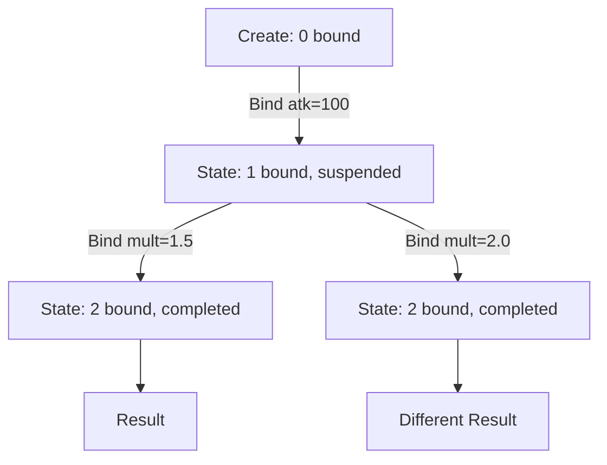

# Curry Evaluator and Three-Evaluator Architecture

Its core design question: how to enable gradual parameter binding and per-instruction step debugging without maintaining mutable state per formula, while keeping the hot path zero-overhead.

The answer is to separate the execution core (register machine loop) from the suspension strategy: three evaluators share the same `bytecode → registers` execution logic, differing only in when to suspend, how to copy state, and whether to allow external inspection.

## Three-Evaluator Architecture

| | Hot Path | Curry | Step Debug |
|---|---|---|---|
| Type | `FluxEvaluator<TData,TDef>` | `FluxCurryEvaluator<TData,TDef>` | `FluxStepEvaluator<TData,TDef>` |
| Suspension unit | None (full speed) | Between Immediate variables | Every instruction |
| State copy | None | Every `Bind` | Every `Step` |
| ref struct | Yes | No | No |
| Injector | `FluxJITInjector` (JIT) or `FluxInjector` (interpreter) | Built-in `_boundValues` array | Built-in (no external injection) |
| Register storage | `stackalloc TData[]` (stack) | `TData[]` (heap) | `TData[]` (heap) |
| Purpose | Production | Gradual parameter injection | Debugging/visualization |

All three evaluators share the same register machine execution core (`while (ip < instrCount)` loop, three-way dispatch: Immediate/Instruction/Return), differing only in suspension strategy. The curry and step-debug evaluators must persist intermediate state on the heap (since they survive across StackFrames), using `TData[]` arrays instead of `stackalloc`.

## Why Three Evaluators

The hot path demands minimum overhead: `ref struct` ensures stack allocation, `stackalloc` keeps the register file within cache lines, single-pass with zero state copies. The curry evaluator needs to persist intermediate state across `Bind` calls, returning a new instance after each injection -- this requires heap allocation and full state copies. The step debugger needs to expose IP, opcode, and register snapshots at every instruction boundary.

These three requirements pull the design in opposite directions; a single evaluator cannot serve all three efficiently.

## FluxCurryEvaluator: Functional State-to-State

### Core Data Structure

13 `readonly` fields in two categories:

**Immutable (shared references across all instances)**: `_definition` (definition body), `_bytecode` (bytecode copy), `_varImmIndices` (variable Immediate indices), `_varNames` (variable names), `_immCount`, `_instrCount`, `_maxRegister`.

**Mutable (deep-copied on each `Bind`)**: `_regs` (register file), `_boundValues` (bound values), `_boundMask` (binding bitmask), `_boundCount`, `_ip` (suspension point instruction pointer), `_completed`, `_result`.

The constructor is `private`. The `Create` factory method handles initialization: extracts bytecode and variable slot information from `FluxFormula`, then calls `Resume` to advance to the first suspension point.

### Suspension Mechanism

`Resume` is the shared register machine execution core. At Immediate instructions:

1. If the Immediate corresponds to a variable slot, check `_boundMask[varPtr]`
2. If unbound: immediately return a new state with `_ip` pointing at this Immediate (suspension point)
3. If bound: read the value from `_boundValues`, write to register, continue execution

Non-variable Immediates (compile-time constants) are read directly via pointer reinterpretation `*(TData*)(pBase + ip + 1)` and do not trigger suspension.

### Bind API

**Bind by position (v5.3+)**: `Bind(params TData[] values)` iterates `_boundMask` to find the next unbound position, calls `BindAt` per value. No name lookup, zero additional allocations.

**Bind by name (v5.9.0)**: `Bind(string name, TData value)` linearly scans `_varNames` to locate the index, then calls `BindAt`. O(n) name lookup (n typically 2-20). Throws if the name does not exist or is already bound.

**Silent injection (v5.11.0)**: `TryBind(string name, TData value)` and `TryBind(params TData[] values)` silently skip when a variable name does not exist or is already bound. Suitable for post-processing formula injection scenarios -- callers need not know the formula signature in advance.

**Force complete**: `ForceComplete()` fills all remaining unbound slots with `default(TData)`, then runs to completion at full speed.

### BindAt Internals

Each `BindAt` performs three copies:

1. Copy the `_boundValues` array and write the new value
2. Copy the `_boundMask` array and set the corresponding bit
3. Copy the `_regs` array (preserving register state from already-executed instructions)

Then calls `Resume` to continue execution from the current `_ip`. This "copy-then-resume" model guarantees functional semantics: the old state is unaffected, enabling forking multiple evaluation paths from the same intermediate state.

### Usage Pattern

```csharp
var curry = assembler.Instantiate(formula, curry: true);
curry = curry.Bind("atk", 100f);       // bind by name
curry = curry.Bind("mult", 1.5f);      // continue binding
float result = curry.Result;           // final evaluation
```



## FluxStepEvaluator: Per-Instruction Stepping

### Core Data

7 `readonly` fields: `_definition`, `_bytecode`, `_regs`, `_ip`, `_instrCount`, `_completed`, `_result`. No injector (variables are already injected as constant Immediates before `Create`).

### Exposed Diagnostic State

- `CurrentIP` -- current instruction pointer
- `CurrentOpCode` -- opcode byte of the current instruction
- `CurrentInstruction` -- the full `Instruction` struct (including Dest, Arg0-Arg5)
- `Regs` -- read-only register file snapshot (`ReadOnlySpan<TData>`)

### Step Method

Each `Step()` executes exactly one instruction:

1. Copy the `_regs` array
2. Execute one instruction (Immediate pointer read, Instruction calls `Compute`, Return writes to Bus or returns result)
3. Return the new state

`RunToEnd()` repeatedly calls `Step()` in a loop until completion.

## Orthogonality with FluxChain

FluxChain handles **compile-time formula composition** (`Connect()` joins multiple formula fragments), while the curry evaluator handles **runtime gradual parameter binding**. The two are orthogonal:

- `fA.Connect(fB).Connect(fC)` -- builds a chained formula structure at compile time
- `.Instantiate(curry: true).Bind("x", 1f).Bind("y", 2f).Result` -- gradually injects and evaluates at runtime

The DamageMultiverse example demonstrates the curry evaluator reducing 3000 `Set` calls (1000 runs * 3 variables) to 2 `Bind` calls + 1000 single-variable forks.

## References

- [Interpreter Execution Loop](./evaluator.md) -- shared register machine execution core
- [Data Injector](./injector.md) -- FluxInjector hot-path injection
- [ChainLink Deep Dive](../chainlink-deep-dive.md) -- chained formula composition
- [Progressive Binding Guide](../../guide/curry-evaluator.md) -- user-facing API guide
