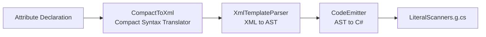

# Literal Scanner Source Generator

Its core design question: how to move literal scanning from runtime (hand-written Span loops, reflection, delegates) to compile time, achieving declarative definition and automatic code generation while maintaining zero allocation and type safety.

The answer is a four-layer Source Generator pipeline: developers declare data formats via attributes; the `IIncrementalGenerator` translates them into dedicated C# Span scanners at compile time, injected into the `LiteralScanners` partial class. Zero reflection, zero boxing, zero delegate allocation at runtime.

## Four-Layer Pipeline



### Layer 1: Attribute Declaration

Four attributes form the declarative data format definition:

| Attribute | Target | Semantics |
|-----------|--------|-----------|
| `[LiteralTemplate("...")]` | struct | Define a literal template for the struct |
| `[ExternalLiteralTemplate(typeof(X), "...")]` | assembly | Define a template for a third-party type (without modifying the original type) |
| `[LiteralTypeAlias("Alias", "float")]` | assembly | Custom type alias; templates can use the alias instead of the full type name |
| `[LiteralTag("tag")]` | enum member | String tag for enum members; auto-generates tag-to-enum scanners |

### Layer 2: CompactToXml — Compact Syntax Translator

The compact template syntax:

```
<float X> <float Y>
```

is translated to standard XML:

```xml
<literal-template>
  <field type="float" name="X"/>
  <text> </text>
  <field type="float" name="Y"/>
</literal-template>
```

Developers can use either compact format or write XML directly. `IsCompactFormat()` determines the format by checking whether the input starts with `<literal-template`.

### Layer 3: XmlTemplateParser — XML to AST

Parses XML templates into an AST node tree. Four node types:

| Node | XML Tag | Semantics | Min | Max |
|------|---------|-----------|-----|-----|
| `LiteralTextNode` | `<text>...</text>` | Exact character-by-character literal text matching | — | — |
| `FieldDirectiveNode` | `<field type="" name=""/>` | Invokes the corresponding type scanner to read a value | 1 | 1 |
| `OptionalBlockNode` | `<optional>...</optional>` | Attempts to match inner nodes; rolls back and continues on failure | 0 | 1 |
| `RepetitionBlockNode` | `<repetition>...</repetition>` | Loops matching until failure; rolls back and exits the loop | 0 | ∞ |

Template dependency graph and topological sort: when struct A's template references struct B, `BuildDependencyGraph` constructs a directed graph, detects circular dependencies (FLX002), and produces a topological ordering. `CodeEmitter` emits code in dependency order (dependents emitted first so they are available to their consumers).

### Layer 4: CodeEmitter — AST to C# Source

Generated `Scan_Xxx` method characteristics:

- Signature: `static T Scan_Xxx(scoped ReadOnlySpan<char> source, out int charsConsumed)`
- Bare text blocks: character-by-character comparison `source[consumed + i] == text[i]`
- Field blocks: delegates to the corresponding type scanner (built-in or generated)
- Optional blocks: save/restore `consumed` position for transactional rollback
- Repetition blocks: `while (true)` loop + internal try-match + break on failure

Generated code is annotated with `[MethodImpl(AggressiveInlining)]` and registered in `ScannerRegistry<TData>`.

## IIncrementalGenerator Input Pipelines

`LiteralScannerGenerator` uses four incremental input pipelines:

| Pipeline | Input | Filter | Output |
|----------|-------|--------|--------|
| A | structs with `[LiteralTemplate]` | `StructDeclarationSyntax` | `StructInfo` (name, fields, template) |
| B | `[ExternalLiteralTemplate]` | Any syntax node | Same `StructInfo` as Pipeline A |
| C | `[LiteralTypeAlias]` | assembly-level attribute | Alias mapping |
| D | enum members with `[LiteralTag]` | `EnumMemberDeclarationSyntax` | tag-to-enum scanner |

Pipeline B's `ExternalLiteralTemplate` is designed to override Pipeline A: an external template for the same struct name takes priority over the internal one, enabling replacement of third-party type scanners without modifying source code.

## Generated Output

```csharp
// LiteralScanners.g.cs (auto-generated)
namespace FluxFormula.Core
{
    partial class LiteralScanners
    {
        static LiteralScanners()
        {
            // Register all generated scanners
            ScannerRegistry<Damage>.Scanner = Scan_Damage;
            ScannerRegistry<Vector3>.Scanner = Scan_Vector3;
        }

        [MethodImpl(MethodImplOptions.AggressiveInlining)]
        public static Damage Scan_Damage(
            scoped ReadOnlySpan<char> source, out int charsConsumed)
        {
            // Compile-time generated high-performance Span scanner
        }
    }
}
```

## Compiler Diagnostics

| Code | Level | Description |
|------|-------|-------------|
| FLX001 | Error | Template parse error (syntax error, invalid type name) |
| FLX002 | Error | Circular template dependency (A references B, B references A) |
| FLX003 | Error | readonly struct with LiteralTemplate (cannot assign fields) |
| FLX004 | Warning | Template references a non-built-in type without LiteralTemplate; the field is skipped |

## Relationship with FluxLexer

`FluxLexer` selects the literal scanner at construction time in priority order:

1. `LiteralScanners.TryGetScanner<TData>()` -- if a `[LiteralTemplate]` definition exists
2. `config.LiteralScanner` manual delegate -- callback fallback
3. Throw `ArgumentException` -- neither available

This priority design ensures the Source Generator path always takes precedence over runtime delegates.

## Gene Relationship with SourceSerializer

SourceSerializer (independent UPM library) inherits its genes from this pipeline. The current four-layer pipeline in FluxFormula (attribute → CompactToXml → XmlTemplateParser → CodeEmitter) will be extracted into a standalone general-purpose declarative serialization framework. After FluxFormula's Lexer overhaul, it will become SourceSerializer's first consumer: Token definitions, operator definitions, and variable pattern definitions will all use declarative attribute definitions; the SG will produce a complete dedicated Lexer.

## References

- [Lexer](./lexer.md) -- how FluxLexer consumes generated scanners
- [Literal Scanner Guide](../../guide/literal-scanner.md) -- user-facing API guide
- [Source Technical Analysis](../technical-analysis.md) -- line-by-line architecture analysis
