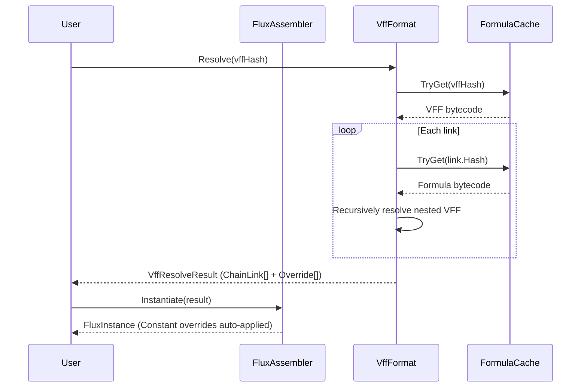

# VFF Persistence Format

Its core design question: how to reference and compose pre-compiled formulas without embedding their full bytecode; resolving on demand at runtime while reusing existing JIT delegate caches.

VFF (Virtual FluxFormula) is the persistent form of `ChainLink[]`. It does not store formula content; it stores `DualHash64` references to existing formulas in blobs plus parameterized overrides.

## DLL Analogy

| Concept | Blob / VFF Mapping |
|---------|-------------------|
| DLL (exports symbols) | `.blob` file (exports formula bytecode, indexed by DualHash64) |
| Import Table (references symbols) | `.vff` file (references formulas in blobs + override parameters) |
| Dynamic Linker (symbol resolution) | `VffFormat.Resolve()` (hash → ChainLink[] → FluxFormula) |

A `.vff` file contains no formula bytecode -- only instructions for "which blob formulas to reference + how to override parameters." The resolution process is analogous to dynamic linking: look up cached bytecode by hash, assemble into an executable chained formula.

## Binary Layout

```
Offset  Size   Field
0       4      Magic: 'V' 'F' 'F' '\0'
4       1      Version: 1
5       1      LinkCount (uint8)
6       1      OverrideCount (uint8)
7       1      Flags (reserved)

──────────────────────────────────────────
LinkTable (offset 8): LinkCount × 22 bytes
──────────────────────────────────────────
  Each Link:
    0   16     DualHash64 (XxHash64 8 LE + FnvHash64 8 LE)
    16  1      ImmediateCount (uint8)
    17  2      InstructionCount (uint16 LE)
    19  1      FluxType (0=Formula, 1=Modifier)
    20  2      VariableSlotCount (uint16 LE)

──────────────────────────────────────────
OverrideTable (after LinkTable):
──────────────────────────────────────────
  Each Override:
    0   2      GlobalSlot (uint16 LE)
    2   1      Kind (0=Inject, 1=Constant)
    ── If Kind=Constant ──
    3   1      DataLen (uint8) = sizeof(TData)
    4   N      Data (TData value)
```

## Resolve Pipeline

`VffFormat.Resolve<TData, TDef>(hash)` resolution flow:

1. Look up VFF bytecode from `FormulaCache` (by `DualHash64`)
2. Parse header: LinkCount, OverrideCount
3. Per-link iteration over the LinkTable:
   - Look up the link's formula bytecode via `FormulaCache.TryGet(link.Hash)`
   - If the link itself is a VFF (detected via `FluxArtifactKind`), recursively `Resolve`
   - Build `ChainLink`: Key, Bytecode, InstructionCount, Type, ImmediateCount, VarSlots, MaxRegister
   - Accumulate `cumulativeSlotOffset`: each link's SlotIndex offset increments
4. Build `VffResolveResult`: `ChainLink[]` + `VffOverride[]`

## Recursive Resolution with DAG Cycle Detection

VFF supports nested references: a VFF link can reference another VFF. The resolver uses a `HashSet<DualHash64>` to track the current resolution stack:

```csharp
if (!visited.Add(entry.Hash))
    throw new InvalidOperationException(
        $"Circular VFF reference detected: {entry.Hash}");
// Recursively resolve nested VFF
var nested = Resolve<TData, TDef>(entry.Hash, visited);
visited.Remove(entry.Hash);
```

- Duplicate resolution avoided: hashes already in `visited` are skipped (DAG sharing)
- Circular references rejected: `Add` returning false throws an exception
- O(N) time complexity, N = total number of referenced formulas

## Override Semantics

Two override types:

| Kind | Semantics | Applied When |
|------|-----------|-------------|
| `Inject` (0) | Caller injects at runtime via `FluxInjector.Set` | User code |
| `Constant` (1) | Hardcoded fixed value in VFF bytes | `Assembler.Instantiate` (v5.9.1 auto) |

`GlobalSlot` is the global slot index in the merged chain space. Each link's SlotIndex is converted to a global index by adding the `cumulativeSlotOffset`.

**v5.9.1 auto-apply**: `FluxAssembler.Instantiate(chain)` detects `VffOverride[]` in the chain, automatically applies Constant overrides via `TrySet`. Inject overrides are left for the caller.

## Usage Flow



## References

- [ChainLink Deep Dive](./chainlink-deep-dive.md) -- ChainLink structure and per-link JIT caching
- [Compile Cache Pipeline](./compile-cache.md) -- DualHash64 + FormulaCache hash lookup foundation
- [Data Injector](./pipeline/injector.md) -- TrySet silent injection (VFF override application mechanism)
- [VFF Persistence Example](../examples/vff-persistence.md) -- user-facing save/load round-trip example
