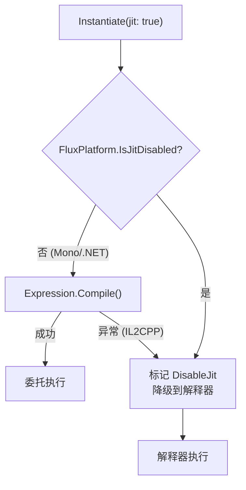

# 高级用法

## Connect：链式组合

`Connect()` 不合并字节码，它在 `ChainLink[]` 末尾追加对原始公式的引用切片，物理拼接推迟到求值时刻。

```
Connect(fA, fB):
  ChainLink[] = [Link(fA), Link(fB)]   // 零字节码复制，仅追加引用
```

求值时，短链（≤8）逐 link 求值，通过 R1 总线传递结果；长链或 JIT 路径自动合并为原子公式后单次求值。详见 [ChainLink 深度解析](../technical/chainlink-deep-dive)。

### Formula ↔ Modifier

`ToModifier()` 将 Formula 的第一个操作数替换为 R1 输入（从前一个 link 的输出读）；`ToFormula(name)` 将 Modifier 的 R1 输入替换为命名变量。

```csharp
var fA = Compile("x + y");                 // Formula
var fB = Compile("z * 2");                 // Formula

// ✅ B 消费 A 的输出：先转 Modifier
var chain = fA.Connect(fB.ToModifier());    // B 的第一操作数来自 R1

// ❌ 编译错误：Connect 只接受 FluxModifier，FluxFormula 传不进去
// var chain2 = fA.Connect(fB);             // CS1503

// Round-trip 保持求值等价
var restored = fB.ToModifier().ToFormula("input");
restored.Set("input", 5f).Set("z", 3f).Run(); // 等价于 fB
```

### 链求值路径

| 路径 | 链长 ≤ MergeThreshold | 链长 > MergeThreshold |
|------|----------------------|----------------------|
| 解释器 | 逐 link Compute（R1 串联） | ToAtomic 合并 → 单次 Compute |
| JIT | 逐 link delegate（`RunJitChain`） | 逐 link delegate（`RunJitChain`） |

## Set：命名变量注入

编译时通过 Lexer 定义变量模式，运行时按名称注入值。

```csharp
var config = new LexerConfig<float, MathDef>
{
    LiteralOper = (byte)MathOp.Const,
    LiteralParser = s => float.Parse(s, CultureInfo.InvariantCulture),
    Operators = { new("+", (byte)MathOp.Add), new("*", (byte)MathOp.Mul) },
    VariablePatterns = { new("[", "]") },
    ImplicitOperators = { (byte)MathOp.Mul },
};

var lexer = new FluxLexer<float, MathDef>(config);
var lexResult = lexer.Lex("[atk] * 2 + [bonus]");

var formula = runner.Compile(lexResult);
var inst = runner.Instantiate(formula);

float r1 = inst.Set("atk", 150f).Set("bonus", 25f).Run();  // 325
float r2 = inst.Set("atk", 100f).Set("bonus", 50f).Run();  // 250
```

### SetIndex：按位置注入

无变量名时按 Immediate 槽位索引注入：

```csharp
var formula = runner.Compile(new[] {
    C(0f), Op((byte)MathOp.Add), C(0f)  // 0 + 0 模板
});

var inst = runner.Instantiate(formula);
float r = inst.SetIndex(0, 10f).SetIndex(1, 20f).Run();  // = 30
```

## JIT vs 解释器：选择策略



## Delegate 缓存

首次 `Instantiate(formula, jit: true)` 调用时 JIT 编译并存入全局缓存，后续同公式实例化直接复用：

```csharp
var runner = new FluxAssembler<float, MathDef>(Def);
var f = runner.Compile(lexer.Lex("2 + 3"));

// 首次：JIT 编译 → 委托存入全局缓存
var r1 = runner.Instantiate(f, jit: true).Run(); // 5

// 再次：缓存命中，零编译
var r2 = runner.Instantiate(f, jit: true).Run(); // 5
```

## 公式序列化：ToBytes / FromBytes

```csharp
// 序列化
byte[] raw = formula.ToBytes();
File.WriteAllBytes("damage_formula.ff", raw);

// 反序列化（零编译）
var loaded = FluxFormula<float, MathDef>.FromBytes(raw);
float r = runner.Instantiate(loaded).Set("atk", 100f).Run();
```

## 将链式公式持久化为 VFF

```csharp
var chain = damageFormula.Connect(critModifier).Connect(elementModifier);

if (chain.IsChained)
{
    var links = chain.GetChainLinks();
    byte[] vffData = VffFormat.ToBytes<float>(
        links.ToArray(),
        Array.Empty<VffOverride<float>>());

    var formatter = new FileFluxFileFormatter();
    formatter.Save(vffData, FluxArtifactKind.Virtual, "DamagePipeline");
}

// 运行时加载 → 解析 → 执行
var result = VffFormat.FromBytes<float, MathDef>(vffData);
float damage = assembler.Instantiate(result.Formula)
    .Set("atk", 100f).Set("def", 50f).Run();
```

参见 [VffFormat API](../api/vff-format) 获取完整的 VFF 编码/解码参考。
