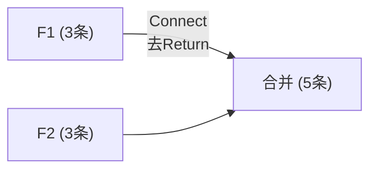
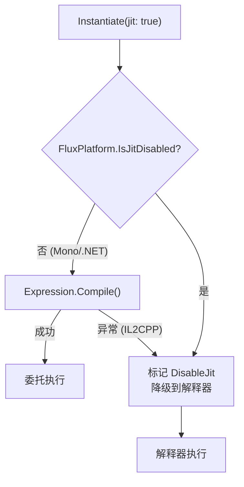

# 高级用法

## Connect：公式拼接

`Connect()` 将两个公式连接：去掉第一个公式末尾的 Return，拼接第二个公式的全部内容。

```csharp
var f42 = runner.Compile(new[] { C(42f) });
// Bytecode: [Immediate(R2,42), Return(Dest=R2)]

// 空公式拼接，卫语句保护
var result = FluxFormula<float, FloatOp>.Empty.Connect(f42);
// Count=0 → 直接返回 f42
```



### 寄存器冲突

`Connect()` 是机械拼接，不重映射寄存器号。如果 F1 使用 R2-R5，F2 也使用了 R2-R5，拼接后 F2 覆写 F1 的寄存器值。适用场景：

- 连接空公式（无寄存器冲突）
- F2 为单操作数 modifier 且引用 R1（总线）

```csharp
// F2 的 Add 缺操作数时编译器自动注入 R1
var f1 = runner.Compile(new[] { C(40f) });               // R2 ← 40
var f2 = runner.Compile(new[] { Op(FloatOp.Add), C(2f) }); // R1 + 2
// F1 的结果在 R2，不在 R1。Connect 后 F2 读 R1 取不到 40。
// Connect 的寄存器一致性由调用方保证。
```

## Set：命名变量注入

编译时通过 Lexer 定义变量模式，运行时按名称注入值。同名变量全部写入。`Set()` 使用内联二分查找定位变量槽位，零 GC。若变量名未在 `VariablePatterns` 中定义，抛出 `ArgumentException`。

```csharp
var config = new LexerConfig<float, FloatOp>
{
    LiteralOper = FloatOp.Const,
    LiteralParser = s => float.Parse(s, CultureInfo.InvariantCulture),
    Operators = { new("+", FloatOp.Add), new("*", FloatOp.Mul) },
    VariablePatterns = { new("[", "]") },
    ImplicitOperators = { FloatOp.Mul },
};

var lexer = new FluxLexer<float, FloatOp>(config);
var lexResult = lexer.Lex("[atk] * 2 + [bonus]");

var formula = runner.Compile(lexResult);
var inst = runner.Instantiate(formula);

float r1 = inst.Set("atk", 150f).Set("bonus", 25f).Run();  // 325
float r2 = inst.Set("atk", 100f).Set("bonus", 50f).Run();  // 250
```

### SetIndex：按位置注入

无变量名时按 Immediate 槽位索引注入：

```csharp
var formula = runner.Compile(new[] {
    C(0f), Op(FloatOp.Add), C(0f)  // 0 + 0 模板
});

var inst = runner.Instantiate(formula);
float r = inst.SetIndex(0, 10f).SetIndex(1, 20f).Run();  // = 30
```

JIT 路径的注入方式一致，但数据写入单独的 payload 数组而非公式缓冲。

## JIT vs 解释器：选择策略



| 场景 | 推荐 |
|------|------|
| Unity Editor 开发 | JIT（编译后速度更快） |
| IL2CPP 构建 (iOS/WebGL/Console) | 解释器（自动降级，无需手动配置） |
| 公式执行次数远大于编译次数 | JIT（编译一次，反复调用） |
| 公式频繁构建 | 解释器（免编译开销） |

## 公式缓存模式

编译一次，缓存复用：

```csharp
public class FormulaCache<TData, TOper, TDef>
    where TData : unmanaged
    where TOper : unmanaged, Enum
    where TDef : unmanaged, IFluxJITDefinition<TData, TOper>
{
    private readonly FluxAssembler<TData, TOper, TDef> _assembler;
    private readonly Dictionary<string, FluxFormula<TData, TOper>> _cache = new();

    public FormulaCache(TDef def) => _assembler = new FluxAssembler<TData, TOper, TDef>(def);

    public FluxFormula<TData, TOper> GetOrCompile(
        string key, ReadOnlySpan<FluxToken<TData, TOper>> tokens)
    {
        if (!_cache.TryGetValue(key, out var formula))
        {
            formula = _assembler.Compile(tokens);
            _cache[key] = formula;
        }
        return formula;
    }

    public FluxInstance<TData, TOper, TDef> Execute(
        string key, ReadOnlySpan<FluxToken<TData, TOper>> tokens, bool jit = false)
    {
        return _assembler.Instantiate(GetOrCompile(key, tokens), jit);
    }
}
```

`_cache` 的 `Dictionary` 在插入时产生 GC。若需零分配，可用数组索引代替字符串 key。

## 持久化：ToBytes / FromBytes

```csharp
// 序列化
byte[] raw = formula.ToBytes();
File.WriteAllBytes("damage_formula.ff", raw);

// 反序列化（零编译）
var loaded = FluxFormula<float, FloatOp>.FromBytes(raw);
float r = runner.Instantiate(loaded).Set("atk", 100f).Run();
```

字节码直接写入文件，无需 JSON/XML 序列化。iOS 热更新场景：替换 `.ff` 文件即更新公式，不触发 JIT，Apple 审核不拦截。
