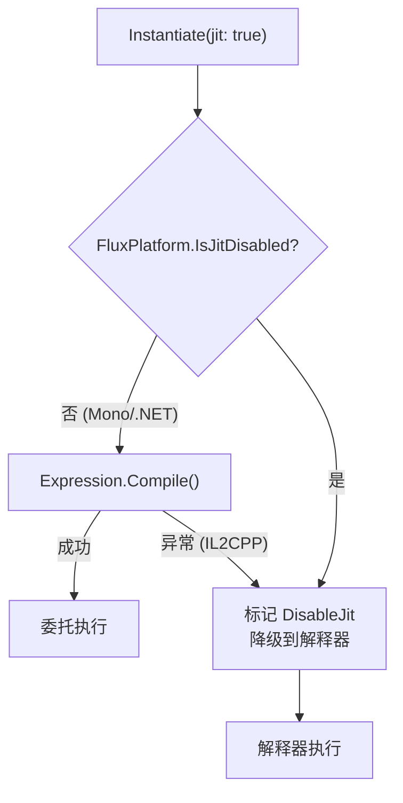

# 高级用法

## Connect：链式组合

`Connect()` 不合并字节码——它在 `ChainLink[]` 末尾追加对原始公式的引用切片，物理拼接推迟到求值时刻。

```
Connect(fA, fB):
  ChainLink[] = [Link(fA), Link(fB)]   // 零字节码复制，仅追加引用
```

求值时，短链（≤8）逐 link 求值，通过 R1 总线传递结果；长链或 JIT 路径自动合并为原子公式后单次求值。详见 [ChainLink 深度解析](../technical/chainlink-deep-dive)。

### Formula ↔ Modifier

`ToMultiplier()` 将 Formula 的第一个操作数替换为 R1 输入（从前一个 link 的输出读）；`ToFormula(name)` 将 Modifier 的 R1 输入替换为命名变量。

```csharp
var fA = Compile("x + y");                 // Formula
var fB = Compile("z * 2");                 // Formula

// ✅ B 消费 A 的输出：先转 Modifier
var chain = fA.Connect(fB.ToMultiplier());  // B 的第一操作数来自 R1

// ❌ Connect 不接受 Formula——编译期拒绝隐式覆盖
// var chain2 = fA.Connect(fB);             // 抛出 ArgumentException

// Round-trip 保持求值等价
var restored = fB.ToMultiplier().ToFormula("input");
restored.Set("input", 5f).Set("z", 3f).Run(); // 等价于 fB
```

### 链求值路径

| 路径 | 链长 ≤ MergeThreshold | 链长 > MergeThreshold |
|------|----------------------|----------------------|
| 解释器 | 逐 link Compute（R1 串联） | ToAtomic 合并 → 单次 Compute |
| JIT | 逐 link delegate（`RunJitChain`） | 逐 link delegate（`RunJitChain`） |

JIT 路径为每 link 独立编译委托，`SetIndex(0, prevResult)` 串联各 link 的输出/输入。解释器短链 per-link 求值避免合并分配；长链合并为连续字节码后单次 Compute 减少循环开销。合并阈值通过 `FluxConfig.MergeThreshold` 配置（默认 8）。

## Set：命名变量注入

编译时通过 Lexer 定义变量模式，运行时按名称注入值。同名变量全部写入。`Set()` 使用内联二分查找定位变量槽位，零 GC。若变量名未在 `VariablePatterns` 中定义，抛出 `ArgumentException`。

```csharp
var config = new LexerConfig<float, FloatOp>
{
    LiteralOper = FloatOp.Const,
    LiteralParser = s => float.Parse(s, CultureInfo.InvariantCulture),
    Operators = { new("+", FloatOp.Add), new("*", FloatOp.Mul) },
    VariablePatterns = { new("[", "]") },
    ImplicitOperators = { FloatOp.Mul },
};

var lexer = new FluxLexer<float, FloatOp>(config);
var lexResult = lexer.Lex("[atk] * 2 + [bonus]");

var formula = runner.Compile(lexResult);
var inst = runner.Instantiate(formula);

float r1 = inst.Set("atk", 150f).Set("bonus", 25f).Run();  // 325
float r2 = inst.Set("atk", 100f).Set("bonus", 50f).Run();  // 250
```

### SetIndex：按位置注入

无变量名时按 Immediate 槽位索引注入：

```csharp
var formula = runner.Compile(new[] {
    C(0f), Op(FloatOp.Add), C(0f)  // 0 + 0 模板
});

var inst = runner.Instantiate(formula);
float r = inst.SetIndex(0, 10f).SetIndex(1, 20f).Run();  // = 30
```

JIT 路径的注入方式一致，但数据写入单独的 payload 数组而非公式缓冲。

## JIT vs 解释器：选择策略



| 场景 | 推荐 |
|------|------|
| Unity Editor 开发 | JIT（编译后速度更快） |
| IL2CPP 构建 (iOS/WebGL/Console) | 解释器（自动降级，无需手动配置） |
| 公式执行次数远大于编译次数 | JIT（编译一次，反复调用） |
| 公式频繁构建 | 解释器（免编译开销） |

## Delegate 缓存

FluxFormula 内置 JIT 委托缓存。`Instantiate(formula, jit: true)` 首次调用时 JIT 编译并存入全局缓存，后续同公式实例化直接复用：

```csharp
var runner = new FluxAssembler<float, FloatOp, FloatMathDef>(Def);
var f = runner.Compile(lexer.Lex("2 + 3"));

// 首次：JIT 编译 → 委托存入全局缓存
var r1 = runner.Instantiate(f, jit: true).Run(); // 5

// 再次：缓存命中，零编译
var r2 = runner.Instantiate(f, jit: true).Run(); // 5
```

缓存后端 `IFluxCacheProvider` 默认使用 `FormulaCache`（槽位数由 `FluxConfig.FormulaCacheCapacity` 控制，默认 2048）。可替换为自定义实现——实现 `TryGet`/`Put`/`TryGetDelegate`/`PutDelegate` 四个方法即可接入自定义缓存策略。详见 [编译缓存管线](../technical/compile-cache)。其他可配置参数（`MergeThreshold`、`ConnectBufferSize`）统一通过 `FluxConfig` 管理。

## 公式序列化：ToBytes / FromBytes

```csharp
// 序列化
byte[] raw = formula.ToBytes();
File.WriteAllBytes("damage_formula.ff", raw);

// 反序列化（零编译）
var loaded = FluxFormula<float, FloatOp>.FromBytes(raw);
float r = runner.Instantiate(loaded).Set("atk", 100f).Run();
```

字节码直接写入文件，无需 JSON/XML 序列化。iOS 热更新场景：替换 `.ff` 文件即更新公式，不触发 JIT，Apple 审核不拦截。

## 将链式公式持久化为 VFF

`Connect()` 产生的链式公式可持久化为 `.vff` 文件，供 blob 部署使用：

```csharp
// 在编辑器中拼接长管道
var chain = damageFormula.Connect(critModifier).Connect(elementModifier);

// 提取链接并序列化为 VFF
if (chain.IsChained)
{
    var links = chain.GetChainLinks();
    byte[] vffData = VffFormat.ToBytes<float>(
        links.ToArray(),
        Array.Empty<VffOverride<float>>());

    // 通过 IFluxFileFormatter 保存（默认实现: FileFluxFileFormatter）
    var formatter = new FileFluxFileFormatter();
    formatter.Save(vffData, FluxArtifactKind.Virtual, "DamagePipeline");
}

// 运行时：从 .vff 文件或 blob 加载 → 解析 → 执行
var result = VffFormat.FromBytes<float, FloatOp>(vffData);
float damage = assembler.Instantiate(result.Formula)
    .Set("atk", 100f).Set("def", 50f).Run();
```

参见 [VffFormat API](../api/vff-format) 获取完整的 VFF 编码/解码参考。
