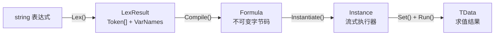
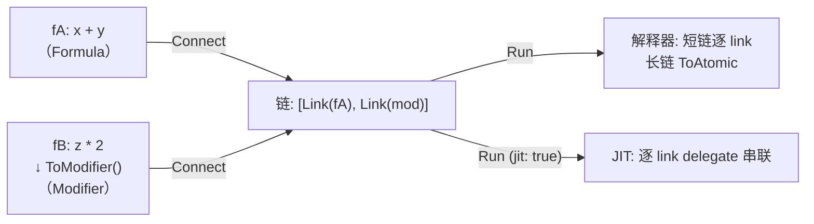

# 核心概念

FluxFormula 的编译流水线与关键数据结构（v3.0.0）。

## 流水线



### Lexer（词法分析）

`FluxLexer<TData, TDef>` 将字符串表达式解析为 Token 流。手写 `ReadOnlySpan<char>` 扫描器，零 Regex，零分配。

配置项：

- **Operators**：符号到操作码的映射（`"+" → (byte)MathOp.Add`，`"*" → (byte)MathOp.Mul`）
- **Brackets**：括号对映射（`"(" ")" → LParen, RParen`）
- **VariablePatterns**：变量前缀/后缀（`"[" "]"` 识别 `[atk]`）
- **ImplicitOperators**：缺省运算符（`2[atk]` → `2*[atk]`）
- **LiteralOper / LiteralParser**：数字字面量的操作码和解析函数

产出 `LexResult<TData>`，内含 Token 数组和变量名数组。

### TokenContext：上下文消歧

Lexer 扫描时遇到符号（如 `-`），无法判断当前期望操作数还是运算符。`ResolveToken(byte oper, TokenContext)` 在编译阶段根据上下文做二次消歧：

| TokenContext | 触发条件 |
|---|---|
| `OperandExpected` | 表达式起点、左括号后、二元运算符后 |
| `OperatorExpected` | 操作数后、右括号后 |

```csharp
// '-' 在期望操作数时是一元取负，否则是二元减法
public byte ResolveToken(byte oper, TokenContext ctx)
{
    if (oper == (byte)MathOp.Sub && ctx == TokenContext.OperandExpected)
        return (byte)MathOp.Neg;
    return oper;
}
```

### Token（词法层）

`FluxToken<TData>` 是中缀表达式的原子构件。每个 Token 由 `Oper`（`byte` 操作码）和 `Data`（数据值）组成。

- **Immediate Token**：携带具体值（如 `Const + 42f`）
- **Operator Token**：运算符（如 `Add`、`Neg`），其 `Data` 为 `default`
- **Pair Token**：括号（如 `LParen`、`RParen`）

### Formula / Modifier（编译产物）

`FluxFormula<TData, TDef>` 和 `FluxModifier<TData, TDef>` 是不可变的字节码容器。由 `FluxAssembler.Compile()` 生成，可缓存复用。

- **Formula**（完整公式）：可独立 `Instantiate` + `Run`
- **Modifier**（缺左操作数）：只能通过 `Connect()` 拼接到 Formula 后方，或通过 `ToFormula(varName)` 转为完整 Formula。没有 `Instantiate()` 方法，编译期保证安全。

### Instance（执行器）

`FluxInstance<TData, TDef>` 是 ref struct 流式执行器。栈分配，不可装箱，零 GC。

## Formula vs Modifier：类型级区分

v3.0.0 中 `FluxFormula` 和 `FluxModifier` 是两个独立类型，区分在**类型系统**而非运行时标签（内部 `FluxType` 枚举已改为 `internal`）：

| 类型 | 首 Token | 能否 Instantiate | 用途 |
|------|----------|:---:|------|
| `FluxFormula<TData, TDef>` | Const 或 一元前缀 或 左括号 | 是 | 完整公式，可直接求值 |
| `FluxModifier<TData, TDef>` | 二元运算符（如 `+`） | **编译不过** | 缺少左操作数，需通过 `Connect()` 拼接到 Formula |

```csharp
var f42 = runner.Compile(new[] { C(42f) });                        // FluxFormula
var mod = runner.Compile(new[] { Op((byte)MathOp.Add), C(5f) });   // FluxModifier

// 编译期类型安全：Connect 只接受 FluxModifier
var combined = f42.Connect(mod);  // 42 + 5，编译通过
// f42.Connect(someFormula) → CS1503 编译错误，无法将 FluxFormula 转为 FluxModifier
```

## Instruction 布局

8 字节定长，显式内存布局（`LayoutKind.Explicit`）：

| 字节偏移 | 0 | 1 | 2 | 3 | 4 | 5 | 6 | 7 |
|----------|---|---|---|---|---|---|---|---|
| **字段** | OpCode | Dest | Arg0 | Arg1 | Arg2 | Arg3 | Arg4 | Arg5 |

- **OpCode**：`byte` 操作码
- **Dest**：结果目标寄存器号
- **Arg0-Arg5**：操作数寄存器号，最大 arity = 6

## 寄存器模型

256 个虚拟寄存器（byte 可寻址范围）：

| 常量 | 寄存器 | 语义 |
|------|--------|------|
| `Registers.Error = 0` | R0 | 错误寄存器。非 default 值触发短路返回 |
| `Registers.Bus = 1` | R1 | 总线寄存器 / 默认结果 |
| `Registers.FirstAlloc = 2` | R2-R254 | 通用寄存器，编译器按需递增分配 |

## 链式 Connect：延迟物化

`Connect()` 不合并字节码，每次 Connect 追加一个 `ChainLink`（对原始公式字节码的引用切片）：



**ChainLink 字段**（公开结构体，可通过 `GetChainLinks()` 访问）：

| 字段 | 说明 |
|------|------|
| `Key` | 该片段字节码的 `DualHash64`，缓存查找键 |
| `Bytecode` | 指向原始 `Instruction[]` 的引用（不复制） |
| `InstructionCount` | 指令数 |
| `Type` | 内部 `FluxType`（Formula 或 Modifier） |

## Formula ↔ Modifier 互转

`ToModifier()` 移除第一数据操作数并将其寄存器引用重命名为 R1；`ToFormula(varName)` 插入命名变量替代 R1 输入。

```csharp
var f = Compile("x + y");           // FluxFormula

var m = f.ToModifier();             // FluxModifier，没有 Instantiate()
// m 不能独立求值，编译不过

var restored = m.ToFormula("input"); // FluxFormula，可以求值了
restored.Set("input", 5f).Run();     // works
```

> v3.0.0：`Connect` 签名只接受 `FluxModifier<TData, TDef>`。传入 `FluxFormula` 编译不过，不需要运行时 `ArgumentException`。

## Delegate 缓存

JIT 编译的委托缓存在 `FormulaCache` 中，由 `DualHash64` 键索引。同一公式多次实例化只编译一次。IL2CPP/AOT 平台自动降级为解释器。

## 解释器 vs JIT

| | 解释器 | JIT |
|------|------|------|
| 机制 | `stackalloc` 寄存器 + 指针循环 | LINQ Expression Tree → `Compile()` 委托 |
| AOT 平台 | 可用 | 自动降级到解释器 |
| 选择方式 | `Instantiate(jit: false)` | `Instantiate(jit: true)` |
