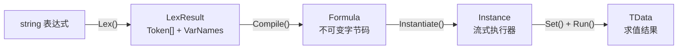

# 核心概念

FluxFormula 的编译流水线与关键数据结构。

## 流水线



### Lexer（词法分析）

`FluxLexer<TData, TOper>` 将字符串表达式解析为 Token 流。手写 `ReadOnlySpan<char>` 扫描器，零 Regex，零分配。

配置项：

- **Operators**：符号到操作符枚举的映射（`"+" → Add`，`"*" → Mul`）
- **Brackets**：括号对映射（`"(" ")" → LParen, RParen`）
- **VariablePatterns**：变量前缀/后缀（`"[" "]"` 识别 `[atk]`）
- **ImplicitOperators**：缺省运算符（`2[atk]` → `2*[atk]`）
- **LiteralOper / LiteralParser**：数字字面量的操作符和解析函数

产出 `LexResult<TData, TOper>`，内含 Token 数组和变量名数组。

### TokenContext：上下文消歧

Lexer 扫描时遇到符号（如 `-`），无法判断当前期望操作数还是运算符。`ResolveToken(TOper, TokenContext)` 在编译阶段根据上下文做二次消歧：

| TokenContext | 触发条件 |
|---|---|
| `OperandExpected` | 表达式起点、左括号后、二元运算符后 |
| `OperatorExpected` | 操作数后、右括号后 |

```csharp
// '-' 在期望操作数时是一元取负，否则是二元减法
public FloatOp ResolveToken(FloatOp op, TokenContext ctx)
{
    if (op == FloatOp.Sub && ctx == TokenContext.OperandExpected)
        return FloatOp.Neg;
    return op;
}
```

### Token（词法层）

`FluxToken<TData, TOper>` 是中缀表达式的原子构件。每个 Token 由 `Oper`（操作符枚举）和 `Data`（数据值）组成。

- **Immediate Token**：携带具体值（如 `Const + 42f`）
- **Operator Token**：运算符（如 `Add`、`Neg`），其 `Data` 为 `default`
- **Pair Token**：括号（如 `LParen`、`RParen`）

### Formula（编译产物）

`FluxFormula<TData, TOper>` 是不可变的字节码容器，持有 `Instruction[]` 缓冲。由 `FluxAssembler.Compile()` 生成，可缓存复用。关键字段：

- `Count`：指令数量
- `ImmediateCount`：立即数槽位数量
- `VariableSlots`：变量名到槽位索引的映射

### Instance（执行器）

`FluxInstance<TData, TOper, TDef>` 是 ref struct 流式执行器。栈分配，不可装箱，零 GC。

## FluxType：Formula vs Modifier

| 类型 | 首 Token | 能否独立 Run | 用途 |
|------|----------|:---:|------|
| `Formula` | Const 或 一元前缀 或 左括号 | 是 | 完整公式，可直接求值 |
| `Modifier` | 二元运算符（如 `+`） | 否 | 缺少左操作数的片段，需通过 `Connect()` 拼接到 Formula |

```csharp
var f42 = runner.Compile(new[] { C(42f) });                   // Formula
var mod = runner.Compile(new[] { Op(FloatOp.Add), C(5f) });   // Modifier，不可 Run

// 正确用法：拼接
var combined = f42.Connect(mod);  // 42 + 5
```

## Instruction 布局

8 字节定长，显式内存布局（`LayoutKind.Explicit`）：

| 字节偏移 | 0 | 1 | 2 | 3 | 4 | 5 | 6 | 7 |
|----------|---|---|---|---|---|---|---|---|
| **字段** | OpCode | Dest | Arg0 | Arg1 | Arg2 | Arg3 | Arg4 | Arg5 |
| **覆盖** | ← ← ← ← Raw (long) → → → → ||||||

- **OpCode**：操作符底层字节（`*(byte*)&enumValue`）
- **Dest**：结果目标寄存器号
- **Arg0-Arg5**：操作数寄存器号，最大 arity = 6
- **Raw**：全部 8 字节的 long 视图，与 OpCode 共用 offset 0，调试用

## 寄存器模型

256 个虚拟寄存器（byte 可寻址范围），前两个有固定语义：

| 寄存器 | 语义 |
|--------|------|
| R0 | 错误寄存器。任何运算可写入非 default 值以触发短路返回。每条指令执行后检查 R0，非 default 则立即终止 |
| R1 | 总线寄存器 / 默认结果。二元运算结果通常写入 R1。表达式无错误时，最终从 Return 指令的目标寄存器获取结果 |
| R2-R254 | 通用寄存器。编译器按需递增分配，永不重用。最多 253 个（受 `MaxRegisters = 255` 限制） |

### OpType 三类指令

| 类型 | 行为 |
|------|------|
| `Immediate` | 将 Token.Data 嵌入指令缓冲，运行时加载到目标寄存器 |
| `Instruction` | 从寄存器读取操作数，调用 `Compute()` 或 JIT Expression 求值，结果写入 Dest 寄存器 |
| `Return` | 终止执行。返回目标寄存器中的值（若无错误）或 R0（若有错误） |

## 解释器 vs JIT

| | 解释器 | JIT |
|------|------|------|
| 机制 | `stackalloc` 寄存器 + `fixed` 指针循环 | LINQ Expression Tree → `Compile()` 委托 |
| 首次开销 | 零 | 有（Expression 编译） |
| 执行速度 | 逐条解释 | 编译后为原生委托调用 |
| AOT 平台 | 可用 | IL2CPP/iOS/WebGL 不可用，自动降级到解释器 |
| 选择方式 | `Instantiate(jit: false)` | `Instantiate(jit: true)` |
