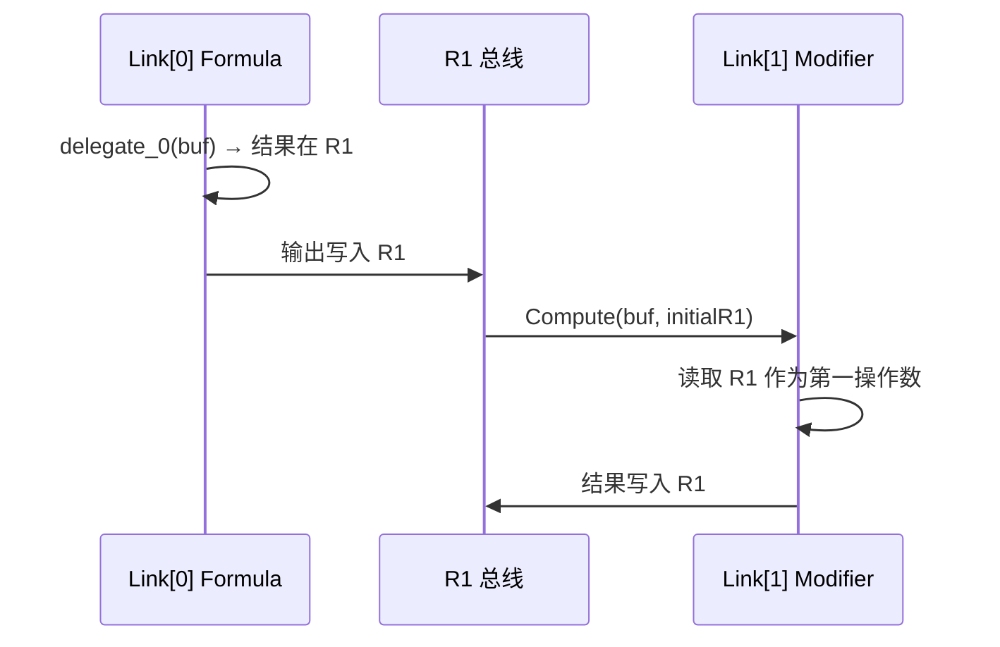

# ChainLink：为什么能正确串接 JIT 编译的委托

ChainLink 不是另一种"拼接"方式，而是**放弃拼接**。本文解释为什么"不拼接"反而让 JIT 委托缓存成为可能。

## 问题：拼接让缓存失效

传统 `Connect` 将两条公式的字节码合并为一块连续内存：

```
Connect(A, B):
  newBuffer = Copy(A.字节码[..-1]) + Copy(B.字节码)  // 新分配
  return new FluxFormula(newBuffer)
```

每次 Connect 产出一个**新公式**：新字节码、新哈希、需要新 JIT 编译。即使 A 和 B 各自的委托已缓存，`Connect(A, B)` 的产物是一个全新实体：

```
A 的委托 → 已缓存 ✓
B 的委托 → 已缓存 ✓
Connect(A, B) 的委托 → 无缓存，必须重新 JIT ✗
```

更致命的是组合爆炸：N 条原子公式的 Connect 产物空间是 O(N²)。同一条公式作为 Modifier 接入不同链时，每次都生成新的合并字节码。

## 方案：不合并

ChainLink 存储的是**引用切片**，不是数据副本：

```csharp
struct ChainLink
{
    DualHash64   Key;              // 该片段字节码的哈希
    Instruction[] Bytecode;        // 引用（指向原始公式的 _buffer）
    int          InstructionCount; // 指令数
    FluxType     Type;             // Formula 或 Modifier
    int          ImmediateCount;   // 数据槽数量
    VariableSlot[] VarSlots;       // 该片段的变量
    byte         MaxRegister;      // 编译期最高寄存器索引（0=未分析）
}
```

`Bytecode` 字段直接引用原始公式的 `Instruction[]`，不分配新内存。

```
Connect(fA, fB):
  ChainLink[] = [Link(fA), Link(fB)]   // 只追加引用，零字节码复制
```

回到缓存问题：A 的委托和 B 的委托各自独立缓存。无论它们以什么顺序出现在多少条链中，每条链的每个 link 都能直接命中缓存：

```
链 1: Connect(A, B)          → [Link(A), Link(B)]          → A.delegate + B.delegate（均命中）
链 2: Connect(C, B)          → [Link(C), Link(B)]          → C.delegate + B.delegate（均命中）
链 3: Connect(A.ToModifier, B.ToModifier) → [Link(A_mod), Link(B_mod)] → 各命中
```

N 条公式，O(N) 个委托，任意链式组合的求值都只涉及已缓存的委托。组合爆炸被消解。

## 为什么每个 Link 可以独立 JIT 编译

关键约束来自 FluxFormula 的寄存器模型：**R0 = 错误，R1 = 输入/输出总线，R2-R254 = 临时**。

每条公式编译时，编译器为其分配独立的临时寄存器（R2 起）。两条不同的公式即使使用相同的寄存器号（都用了 R2、R3），也不共享寄存器空间：它们在各自的委托/解释器调用中独立求值。



Per-link 求值通过两个机制保证正确性：

### 解释器路径

`FluxEvaluator.Compute(ReadOnlySpan<Instruction>)` 将每个 link 的字节码作为独立程序执行。非首个 link 使用 `Compute(span, initialR1)`：求值开始前将 R1 初始化为前一个 link 的输出。Modifier 的字节码（经 `ToModifier` 转换）已移除第一 Immediate，其第一条指令直接从 R1 读入。

### JIT 路径

JIT 需要连续字节码。`ToAtomic` 将所有 link 完整拼接（不丢弃任何指令），包括中间的 Return。解释器对中间 Return 做特殊处理：

```
返回指令后还有更多指令 (ip + 1 < raw.Length)
  → 不退出，将 Dest 寄存器值复制到 R1，继续执行下一个 link
```

这使得合并后的字节码中，每个 link 的 Return 自然地作为"R1 总线写入点"，下一个 link 的指令从 R1 读取。

## Modifier 的角色

ChainLink 中的一条 link 可以是 Formula 或 Modifier。Formula 从自身的第一操作数开始计算；Modifier 的第一操作数来自 R1（前一个 link 的输出）。

`ToModifier()` 在字节码层面实现此转换：

```
Formula "2 + 3":
  [Imm(2)→R2] [Imm(3)→R3] [Add R2,R3→R4] [Return R4]

ToModifier() → Modifier:
  [Imm(3)→R3] [Add R1,R3→R4] [Return R4]
   ↑ 第一操作数由 R1 提供，2 被移除，R2 被重命名为 1
```

`ToFormula(varName)` 执行逆操作：插入命名变量替代 R1 输入。

ChainLink 本身不做自动转换：`Connect(A, B)` 中 B 保持原样。若需要 B 消费 A 的输出，调用方显式使用 `Connect(A, B.ToModifier())`。

## ToAtomic：链→原子合并

当链需要合并为单块连续字节码时（长链解释器路径、AOT 降级场景），`ToAtomic()` 将所有 link 的 `Instruction[]` 原样拼接为一个数组。JIT 路径默认使用 per-link delegate（`RunJitChain`），不触发合并。

```csharp
// 所有 link 的字节码完整拼接，不丢弃任何指令
int totalCount = links[0].InstructionCount + links[1].InstructionCount + ...;
var merged = new Instruction[totalCount];
// 逐 link 复制全量
```

合并后的字节码可直接送入 JIT 编译器或解释器。由于解释器支持中段 Return 语义，合并后的字节码求值结果与 per-link 逐条求值完全一致。

## 性能模型

| 操作 | 分配 | 备注 |
|------|------|------|
| `Connect(A, B)` | `ChainLink[2]`（极小） | 无不必要的字节码复制 |
| `Run()` 短链（≤8） | 每 link：`Instruction[]` 副本 | 仅为求值所需，非合并 |
| `ToAtomic()` | 合并 `Instruction[]` | 仅在 JIT 或超长链时触发 |
| Delegate 缓存命中 | 仅 payload 重建 | JIT 编译本身被跳过 |

## 内部变量保留

`ChainReserved.InternalPrefix = "CHAIN_LINK_INTERNAL_"` 是链式求值内部使用的变量名前缀。用户声明的变量不得使用此前缀。

## 相关文档

- [核心概念](../guide/core-concepts.md#链式-connect延迟物化)：链式 Connect 的概念概述
- [编译缓存管线](./compile-cache.md)：DualHash ↔ FormulaCache ↔ Delegate 缓存全链路
- [架构决策记录](./architecture-decisions.md)：ADR-3 (延迟物化), ADR-6 (中段 Return)
