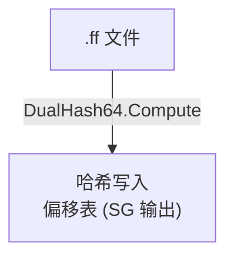
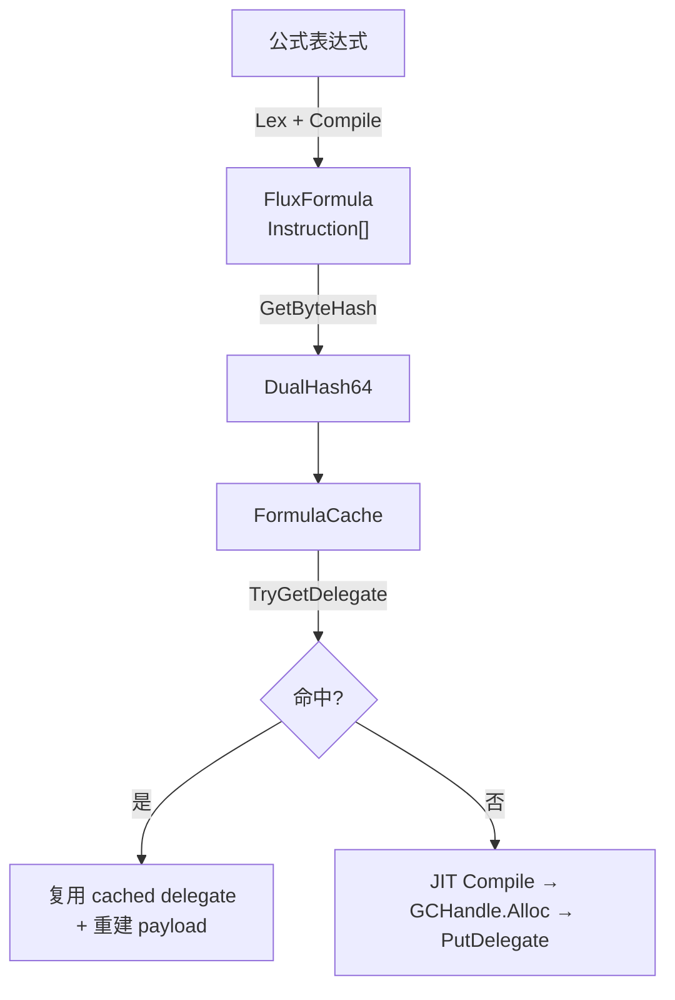
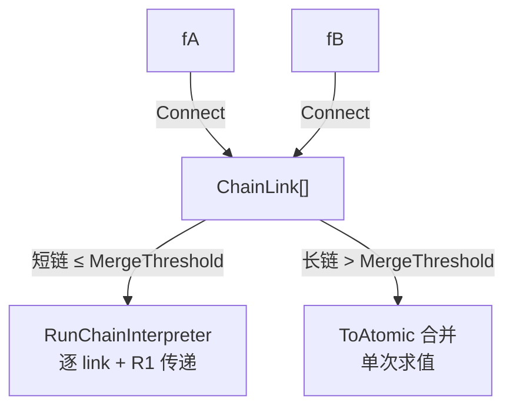

# 编译缓存管线

公式字节码的哈希、缓存、链式组合与 JIT 委托缓存的全链路。

## 架构全景

**编译期**——公式文件哈希写入偏移表：



**运行时**——Lex → Compile → 缓存查询 → JIT/复用：



**Connect**——链式组合与求值策略：



## 双重哈希设计

`DualHash64` 是两个非密码学哈希的组合：**xxHash64**（高 64 位）+ **FNV-1a 64**（低 64 位）。

### 为什么需要两个

单独一个非密码学哈希的碰撞空间在生日攻击下约 2³²（对 64-bit 输出）。了解内部状态的攻击者可构造结构性碰撞——利用哈希函数的代数弱点找到冲突的输入对。

两个内部结构正交的哈希函数使碰撞攻击退化为"同时满足两个联立方程"：攻击者需要找到一条字节序列，同时满足 xxHash64 和 FNV-1a 64 的碰撞条件。两者的代数弱点不共享（xxHash 依赖乘法混洗和旋转，FNV 依赖 XOR 和质数乘法），联立求解在实际意义上不可行。

### 哈希存储策略

哈希**不存储在 blob 数据文件内**，而是写入 Source Generator 生成的偏移表（编译进 assembly）：

```
偏移表 (assembly 内)                     Blob (数据文件)
  offset_A → (hash1, hash2)    →    [bytecode_A 原始字节]
  offset_B → (hash1, hash2)    →    [bytecode_B 原始字节]
```

攻击者修改 blob 文件时必须同步修改偏移表——而偏移表已编译为 IL，篡改需要反编译并重编译程序集。

### xxHash64 实现

32 字节分条处理，四条累加器并行：

```
v1 = seed + P1 + P2    v2 = seed + P2
v3 = seed              v4 = seed - P1

每 32 字节分条:
  v1 = round(v1, lane1)  v2 = round(v2, lane2)
  v3 = round(v3, lane3)  v4 = round(v4, lane4)

合并: h = rotl(v1,1) + rotl(v2,7) + rotl(v3,12) + rotl(v4,18)
      mergeRound(h, vi) × 4
      h += len

余数: 8 字节 → 4 字节 → 逐字节
雪崩: h ^= h>>33; h*=P2; h ^= h>>29; h*=P3; h ^= h>>32
```

已与 .NET 9 `System.IO.Hashing.XxHash64` 对 0~256+ 字节全范围交叉验证。

### FNV-1a 64 实现

逐字节 XOR 后乘质数，~10 行代码：

```
hash = 0xCBF29CE484222325  (FNV_offset_basis)
for each byte b:
    hash ^= b
    hash *= 0x100000001B3  (FNV_prime)
```

空字符串基准 `0xCBF29CE484222325` 与 FNV 规范一致。

### Combine：链 key 计算

`DualHash64.Combine(a, b)` 对两次哈希做 O(1) 代数混合，不重新扫描字节序列。为 Connect 链路提供顺序敏感的累进 key：

```
Connect(A, B) 的键 = Combine(hash(A), hash(B))
Connect(A, B, C) 的键 = Combine(Combine(hash(A), hash(B)), hash(C))

Combine(A, B) ≠ Combine(B, A)  // 顺序敏感
```

## FormulaCache

开放寻址 hashmap（默认 2048 槽，可通过 `FluxConfig.FormulaCacheCapacity` 调整），无链表指针，无 GC 分配。

### 存储结构

```
_xxHashKeys[capacity]   ulong[]    DualHash64.XxHash64 分量
_fnvHashKeys[capacity]  ulong[]    DualHash64.FnvHash64 分量
_valuePtrs[capacity]    IntPtr[]   字节码指针 或 GCHandle 句柄
_valueLengths[capacity] int[]      状态标记 + 长度
```

### 状态标记

| 值 | 含义 |
|----|------|
| ≥ 0 | 字节码条目，值为字节长度 |
| -1 (Empty) | 空槽位，从未写入 |
| -2 (DelegateSlot) | JIT delegate 缓存条目 |
| -3 (Tombstone) | 曾有条目，已被驱逐 |

### 探测与驱逐

- **线性探测**：`hash(key.XxHash64) % 2048` → 步进直到匹配或空槽位
- **墓碑不阻链**：驱逐时标记为 Tombstone 而非 Empty，确保同探测链上的后续条目可达
- **环形驱逐**：`_ringHead` 指针顺序覆盖，满时覆盖最老条目
- **Compact**：墓碑数超过 `Capacity/4` 时全量 rehash，消除碎片

### GCHandle 生命周期

Delegate 通过 `GCHandle.Alloc(func)` → `GCHandle.ToIntPtr()` 存储。驱逐或 Compact 时自动 `GCHandle.Free()`。字节码指针由 blob（预编译）或公式自身的 `Instruction[]`（运行时 `Raw()` 回退）持有，不经中间层。

## FormulaCache 静态单例

所有缓存操作通过 `FormulaCache.Instance` 全局单例。预编译公式由 `FluxBlob.Initialize()` 在启动时注册——字节码指针直接来自 pinned blob，零拷贝存入 FormulaCache。运行时 JIT delegate 编译后通过 `PutDelegate` 缓存。

ConnectCache（原 1 MB pinned buffer 中间复制层）已移除——blob 管线完成后不再需要运行时字节码中转。

## 链式 Connect

### ChainLink

一条公式的不可变切片。保存原始 `Instruction[]` 引用（不复制）和该片段的独立元数据：

```csharp
struct ChainLink
{
    DualHash64 Key;           // GetByteHash() → 缓存键
    Instruction[] Bytecode;   // 指向原始字节码，不复制
    int InstructionCount;     // 指令数
    FluxType Type;           // Formula / Modifier
    int ImmediateCount;      // 数据槽数
    VariableSlot[] VarSlots; // 该片段的变量槽
    byte MaxRegister;        // 编译期最高寄存器索引（0=未分析）
}
```

### Connect 策略

`Connect` 始终产链——不判断长度，不合并字节码。合并决策集中在 `Instantiate`：

| 路径 | 链长 ≤ MergeThreshold | 链长 > MergeThreshold |
|------|----------------------|----------------------|
| JIT | 逐 link delegate（`RunJitChain`） | 逐 link delegate（`RunJitChain`） |
| 解释器 | 逐 link `Compute(span, initialR1)` | `ToAtomic()` 合并 → 单次 `Compute` |

### 链式解释器求值

`RunChainInterpreter` 逐 link 执行，R1 总线串联：

```
result = kernel.Compute(link0.字节码)                          // R1 = 0
result = kernel.Compute(link1.字节码, initialR1: result)       // R1 = 前一个输出
result = kernel.Compute(link2.字节码, initialR1: result)
...
```

每个 link 的字节码独立——`BuildLinkBuffer` 为每个 link 分配临时 `Instruction[]` 副本并注入变量值（通过 `FluxInjector.GetValue()` O(1) 回读）。

## JIT 委托缓存

### 缓存键

每个公式的委托用其 `GetByteHash()` 作为键：
- 原子公式：`ToBytes()` 的 DualHash64
- 链式公式：所有 link key 的顺序 Combine

### 缓存流程

`FluxAssembler.Instantiate(formula, jit: true)`：

1. 链式公式 → `ToAtomic()` 转为原子
2. `GetByteHash()` → `FormulaCache.TryGetDelegate(hash)`
3. 命中：`GCHandle.FromIntPtr` → cast `CompiledFunc` → `CreateJitPayload` 重建紧凑数据 buffer → 返回
4. 未命中：`FluxJITCompiler.Compile()` → `GCHandle.Alloc(func)` → `PutDelegate(hash, handle)` → 返回

### Payload 重建

Delegate 缓存命中时，调用方不持有原来的 `payload[]`（由 `Compile` 产出）。`CreateJitPayload` 从公式的 `Raw()` 字节码重建紧凑数据数组，与 `Compile` 产出的格式完全一致。

## 平台验证

| 平台 | 解释器 | JIT | Delegate 缓存 |
|------|:---:|:---:|:---:|
| .NET 9 (测试) | 通过 | 通过 | 通过 |
| Unity 2021.3 (Mono) | 预期通过 | 预期通过 | 预期通过 |
| Unity 2022.3+ | 预期通过 | 预期通过 | 预期通过 |
| Unity 6 (CoreCLR) | 预期通过 | 预期通过 | 预期通过 |
| IL2CPP / AOT | 通过 | 降级 | 降级后不适用 |

## 依赖

```
FluxFormula.Core
  ├─ System.Memory (ReadOnlySpan/Span/MemoryMarshal)
  ├─ System.Runtime.CompilerServices.Unsafe
  └─ com.unity.collections 1.2.4 (为 Unity 2021.3 提供 System.Memory)

测试: System.IO.Hashing (xxHash64 交叉验证)
```
