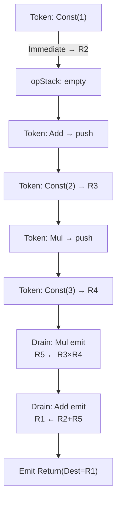
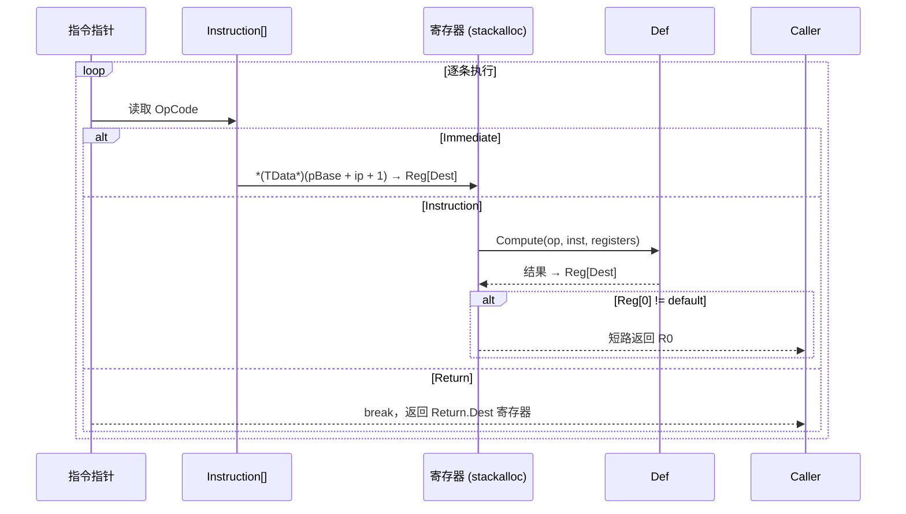

# 内部原理

本文从 `docs/technical-analysis.md` 精简而来。完整逐行分析见该文件。

## 编译流程：调车场算法

`FluxCompiler` 实现标准 Shunting-yard 算法，将中缀 Token 转为后缀字节码：

1. 遍历 Token 序列
2. 每个 Token 根据上下文做消歧：`ResolveToken(op, TokenContext)` 将同一符号映射为不同操作符（如 `-` → 一元取负 vs 二元减法）
3. Immediate → 分配寄存器，嵌入数据到指令缓冲
4. 运算符 → 按优先级和结合性决定是否弹出操作符栈
5. 左括号 → 压栈；右括号 → 弹出直到匹配
6. 遍历结束 → 弹出剩余操作符 → 追加 Return 指令



## 解释器执行循环



## JIT 编译过程

1. 扫描字节码，提取 Immediate 数据到 `payload[]`（紧凑数据数组）
2. 创建 `MaxRegister + 1` 个 `ParameterExpression` 作为寄存器变量——公式头部的 `MaxRegister` 字段（0=未分析，回退 255）决定了按需分配的寄存器数量
3. 逐条指令生成 LINQ Expression：
   - Immediate → `SafeCast(payload, index)` 从数据数组读取
   - Instruction → `GetExpression()` + 赋值 + R0 错误检查
   - Return → 条件表达式（R0 非默认 ? R0 : Dest）
4. `Expression.Lambda.Compile()` → `Func<Instruction[], TData>` 委托

## 数据注入原理

`FluxInjector` 通过 `fixed` 指针直接覆写 `Instruction[]` 中的数据槽位：

```csharp
fixed (Instruction* pBase = _buffer)
{
    *(TData*)(pBase + offset) = value;  // 指针重解释，零拷贝写入
}
```

- 解释器路径：offsets 由编译期 `ImmediateCount` 精确预知，单次扫描 `CreateInjector()` 完成
- JIT 路径：线性索引 `index * slotsPerData`

## 平台兼容性

| 平台 | 脚本后端 | JIT | 解释器 |
|------|----------|:---:|:---:|
| Windows/macOS/Linux (Editor) | Mono | 可用 | 可用 |
| Windows/macOS/Linux (Player) | Mono | 可用 | 可用 |
| iOS/WebGL/Console | IL2CPP | 自动降级 | 可用 |
| Android | IL2CPP | 自动降级 | 可用 |

`FluxPlatform.DisableJit()` 在首次 `Expression.Compile()` 失败时自动调用，后续实例化跳过 JIT 尝试。
