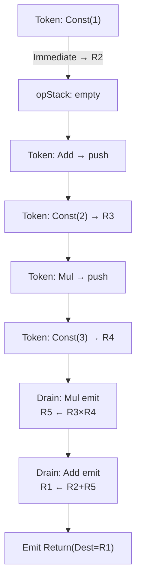
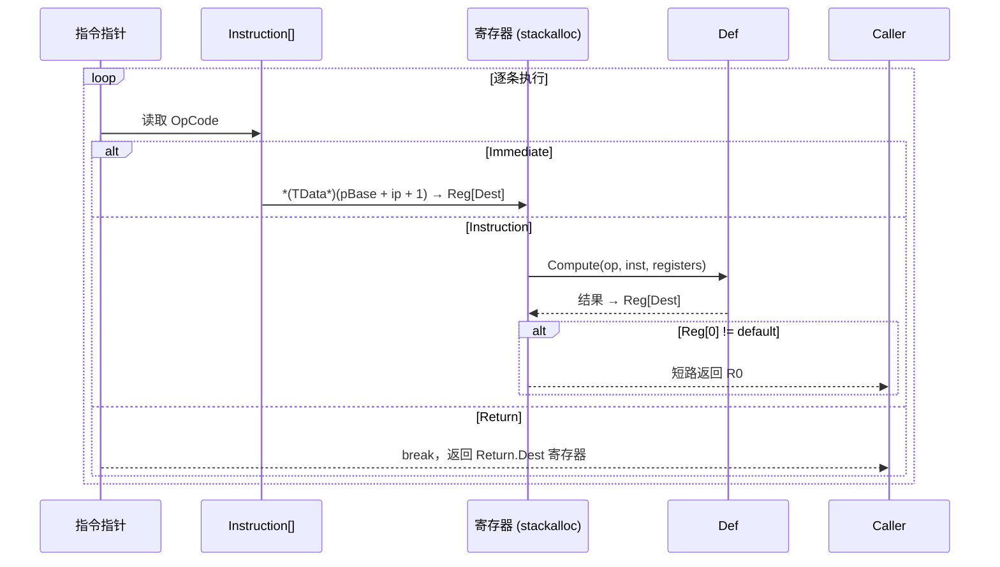

# 内部原理

本文是 FluxFormula 核心内部原理的快速参考。完整逐行分析见[源码技术分析](./technical-analysis.md)，架构决策编年史见[架构决策记录](./architecture-decisions.md)。

## 编译流程：调车场算法

`FluxCompiler` 实现调车场算法，将中缀 Token 转为后缀字节码：

1. 遍历 Token 序列
2. 每个 Token 根据上下文做消歧：`ResolveToken(op, TokenContext)` 将同一符号映射为不同操作符（如 `-` 映射为一元取负 vs 二元减法）
3. Immediate：分配寄存器，嵌入数据到指令缓冲
4. 运算符：按优先级和结合性决定是否弹出操作符栈
5. 左括号：压栈；右括号：弹出直到匹配
6. 遍历结束：弹出剩余操作符，追加 Return 指令

公式头部的 `MaxRegister` 字段（第 14 字节）记录实际使用的最大寄存器索引，运行时按需 `stackalloc` 而非全量 255。



详见[调车场编译器](./pipeline/compiler.md)。

## 解释器执行循环



寄存器模型：R0 = Error（短路返回），R1 = Bus（链式公式输出总线），R2-R254 = 通用寄存器，Max = 255。

详见[解释器执行循环](./pipeline/evaluator.md)。

## JIT 编译：双后端

### 表达式树编译（通用路径）

`FluxExprCompiler` 构建 `ParameterExpression[]` 寄存器文件，逐条指令生成 LINQ Expression，编译为 `CompiledFunc<TData>` 委托。跨平台兼容（IL2CPP/AOT 可用），支持 `FastExpressionCompiler` 优化。

### IL 发射编译（定制路径）

`FluxILCompiler` 使用 `DynamicMethod` + `ILGenerator` 直接发射 IL 字节码，绕过 Expression Tree 的 AST 构建开销。两级内联架构：

- **Tier A**：通过 `callvirt` 调用 `IFluxDefinition<TData>.Compute` 指针重载
- **Tier B**：若 `TDef` 实现 `IFluxILDefinition`，委托给 `EmitOp` 发射手写 IL（零虚调用开销）

三阶降级链：IL（最快，仅 Mono/CoreCLR）→ Expression Tree（通用）→ 解释器（兜底）。`FluxPlatform` 在运行时一次性检测平台能力并全局降级。

详见 [IL 发射编译器](./pipeline/il-compiler.md) 和[表达式树编译](./pipeline/jit.md)。

## 三态求值器

三个求值器共享同一寄存器机执行核心（`while (ip < instrCount)` 循环，三路分发 Immediate/Instruction/Return），区别仅在挂起策略：

| 求值器 | 挂起单位 | State 模型 | 用途 |
|--------|---------|-----------|------|
| `FluxEvaluator`（ref struct） | 无，全速 | stackalloc，不可变 | 生产环境热路径 |
| `FluxCurryEvaluator` | Immediate 变量之间 | 堆数组，函数式 State→State | 渐进式参数绑定 |
| `FluxStepEvaluator` | 每条指令 | 堆数组，函数式 State→State | 逐指令调试/可视化 |

详见[柯里化求值器](./pipeline/curry-evaluator.md)。

## 双路径数据注入

变量值的写入路径取决于执行后端：

- **FluxJITInjector**（JIT 热路径）：2 字段（`_buffer` + `_slotsPerData`），零分支 `SetIndex`。JIT 委托在调用栈上作为值类型传递，零 GC。
- **FluxInjector**（解释器 / 链式 JIT）：11 字段，含并行数组 `_varNames[]` + `_varSlotIndexes[][]` 支持内联二分查找按名注入。`_values[]` 数组提供 O(1) 值回读供链式求值使用。`TrySet` 静默注入适用于 VFF 覆写场景。

详见[数据注入器](./pipeline/injector.md) 和 [JIT 注入器](./pipeline/jit-injector.md)。

## LiteralScanner Source Generator 管线

编译期从 attribute 声明生成专用字面量扫描器，替代运行时反射和手写委托：

```
[Tag] [Template] [LiteralTypeAlias] [ExternalTemplate]
  → LiteralScannerGenerator（IIncrementalGenerator，4 pipeline）
    → CompactToXml（紧凑语法 → XML）
    → XmlTemplateParser（XML → AST）
    → CodeEmitter（AST → C# span scanner）
  → SerializerScanners.g.cs（partial class，编译期注入）
```

生成代码通过 `ScannerRegistry<TData>` 注册，`FluxLexer` 在构造时优先使用生成的扫描器。

详见[字面量扫描器 SG](./pipeline/literal-scanner-sg.md)。

## Blob 注册表

预编译公式的二进制分发管线：

- `IFluxBlobRegistry` 接口（Core 层，零 Unity 依赖）：每个 mod 程序集有各自的 `internal` 实现
- `.blob` 二进制格式：FLXB magic，20B header，24B/条 entry table（DualHash64 + Offset + Length）
- `BlobRegistryGenerator`（IIncrementalGenerator）：编译期读取 `.bytes` 生成编译期常量 `BlobEntry[]`
- `FluxBlob.Load/Unload` 可加模式：支持多 mod 运行时加载和独立卸载，`FluxBlobHandle` 追踪生命周期

详见 [Blob 注册表](./blob-registry.md)。

## VFF 持久化格式

VFF（Virtual FluxFormula）是 `ChainLink[]` 的持久化形态。不存储公式内容，存储对 blob 中已有公式的引用（DualHash64）+ 参数化覆写。核心类比：blob = DLL（导出公式字节码），VFF = import table（引用符号 + 覆写）。

二进制结构：`"VFF\0"` magic → 8B header → LinkTable（22B × N）→ OverrideTable（variable）。支持递归解析（嵌套 VFF）+ DAG 循环检测。

详见 [VFF 格式](./vff-format.md)。

## FluxChain：链式公式组合

`FluxChain<TData, TDef>` 是编译期公式组合的独立类型。`Connect()` 将多个公式片段串联，通过 R1 Bus 寄存器在各 link 之间传递中间结果。不重映射寄存器，每颗"珠子"内部独立使用寄存器。

- **原子/链式由类型系统区分**：`FluxFormula` 永远是原子，`FluxChain` 永远是链式。`ToAtomic()` 显式合并。
- **Per-link JIT 缓存**：同一 modifier 在不同链中共享编译后的委托（LEGO 复用模型）。
- **解释器 MergeThreshold**：链长超过阈值时自动合并为单次原子执行。

详见 [ChainLink 深度解析](./chainlink-deep-dive.md)。

## 平台兼容性

| 平台 | 脚本后端 | IL 编译器 | 表达式树 JIT | 解释器 | Burst |
|------|----------|:---:|:---:|:---:|:---:|
| Editor (Win/Mac/Linux) | CoreCLR | 可用 | 可用 | 可用 | -- |
| Player (Win/Mac/Linux) | Mono / CoreCLR | 可用 | 可用 | 可用 | 可用 |
| iOS / WebGL / Console | IL2CPP | 自动降级 | 降级为解释器 | 可用 | 可用 |
| Android | IL2CPP | 自动降级 | 降级为解释器 | 可用 | 可用 |
| NativeAOT | NativeAOT | 自动降级 | 降级为解释器 | 可用 | -- |

三阶降级链：IL → Expression Tree → 解释器。`FluxPlatform` 在首次失败时全局降级（`volatile`，不可逆）。

## 参考

- [源码技术分析](./technical-analysis.md)：逐文件架构分析
- [架构决策记录](./architecture-decisions.md)：按时间线的 ADR 编年史
- [编译缓存管线](./compile-cache.md)：DualHash64 + FormulaCache 全链路
