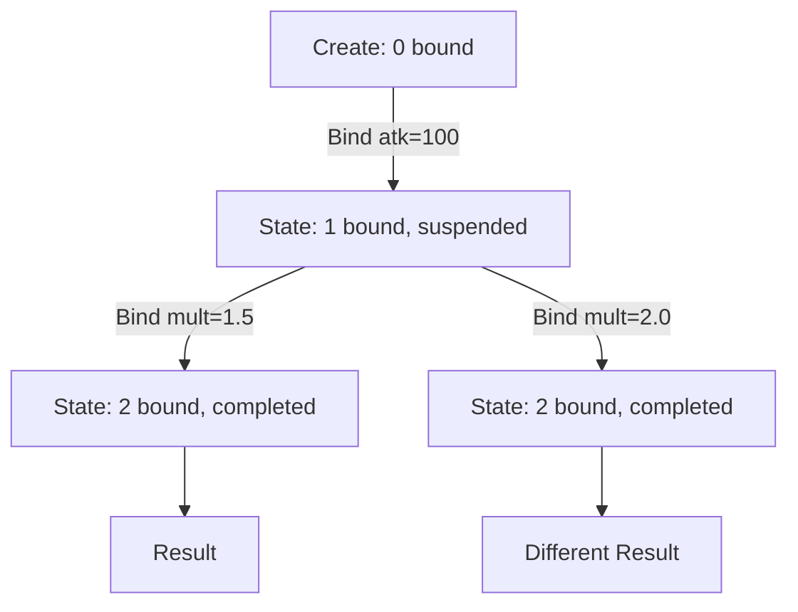

# 柯里化求值器与三态求值架构

其核心设计问题：如何在不为每条公式维护可变状态的前提下，实现参数的渐进式绑定和逐指令步进调试；同时保持热路径的零开销执行。

答案是将执行核心（寄存器机循环）从挂起策略中分离：三个求值器共享同一套 `bytecode → registers` 执行逻辑，区别仅在何时暂停、如何拷贝状态、是否允许外部检查。

## 三求值器架构

| | 热路径 | 柯里化 | 单步调试 |
|---|---|---|---|
| 类型 | `FluxEvaluator<TData,TDef>` | `FluxCurryEvaluator<TData,TDef>` | `FluxStepEvaluator<TData,TDef>` |
| 挂起单位 | 无（全速） | Immediate 变量之间 | 每条指令 |
| State 拷贝 | 无 | 每次 `Bind` | 每次 `Step` |
| ref struct | 是 | 否 | 否 |
| 注入器 | `FluxJITInjector`（JIT）或 `FluxInjector`（解释器） | 内置 `_boundValues` 数组 | 内置（无外部注入） |
| 寄存器存储 | `stackalloc TData[]`（栈） | `TData[]`（堆） | `TData[]`（堆） |
| 用途 | 生产环境 | 渐进式参数注入 | 调试/可视化 |

三个求值器共享同一个寄存器机执行核心（`while (ip < instrCount)` 循环，三路分发 Immediate/Instruction/Return），差异仅在于挂起策略。柯里化和单步调试求值器需要将中间状态持久化到堆上（因为需要跨越多个 StackFrame），因此使用 `TData[]` 数组替代 `stackalloc`。

## 为什么需要三个求值器

热路径需要最小开销：`ref struct` 确保栈分配，`stackalloc` 确保寄存器文件在缓存行内，单次遍历无状态拷贝。柯里化需要在 `Bind` 调用之间保持中间状态，每次注入后返回新实例: 这要求堆分配和完整状态拷贝。单步调试需要在每条指令边界暴露 IP、操作码和寄存器快照。

三种需求将设计拉向相反方向，单个求值器无法同时高效服务三者。

## FluxCurryEvaluator: 函数式 State→State

### 核心数据结构

13 个 `readonly` 字段分为两类：

**不可变（所有实例共享引用）**：`_definition`（定义体）、`_bytecode`（字节码副本）、`_varImmIndices`（变量 Immediate 索引）、`_varNames`（变量名）、`_immCount`、`_instrCount`、`_maxRegister`。

**可变（每次 `Bind` 深拷贝）**：`_regs`（寄存器文件）、`_boundValues`（已绑定的值）、`_boundMask`（绑定掩码）、`_boundCount`、`_ip`（挂起点指令指针）、`_completed`、`_result`。

构造函数为 `private`，`Create` 工厂方法负责初始化：从 `FluxFormula` 提取字节码和变量槽位信息，调用 `Resume` 推进到第一个挂起点。

### 挂起机制

`Resume` 是共享的寄存器机执行核心。在 Immediate 指令处：

1. 如果该 Immediate 对应一个变量槽位，检查 `_boundMask[varPtr]`
2. 若未绑定：立即返回新 state，`_ip` 指向当前 Immediate（挂起点）
3. 若已绑定：从 `_boundValues` 读取值写入寄存器，继续执行

非变量的 Immediate（编译期常量）直接通过指针重解释 `*(TData*)(pBase + ip + 1)` 读取，不触发挂起。

### Bind API

**按位置绑定（v5.3+）**：`Bind(params TData[] values)` 遍历 `_boundMask` 寻找下一个未绑定位置，逐值调用 `BindAt`。无需名称查找，零额外分配。

**按名绑定（v5.9.0）**：`Bind(string name, TData value)` 线性扫描 `_varNames` 定位索引，调用 `BindAt`。O(n) 名称查找（n 通常为 2-20）。名称不存在或已绑定时抛出异常。

**静默注入（v5.11.0）**：`TryBind(string name, TData value)` 和 `TryBind(params TData[] values)` 在变量名不存在或已绑定时静默跳过，不抛异常。适用于后处理公式注入场景: 调用方无需事先知道公式签名。

**强制完成**：`ForceComplete()` 将所有剩余未绑定槽位填充为 `default(TData)`，然后全速求值到结束。

### BindAt 内部

每次 `BindAt` 执行三步拷贝：

1. 拷贝 `_boundValues` 数组并写入新值
2. 拷贝 `_boundMask` 数组并标记对应位
3. 拷贝 `_regs` 数组（保留已执行指令的寄存器状态）

然后调用 `Resume` 从当前 `_ip` 继续执行。这种"拷贝后继续"的模型保证了函数式语义：旧 state 不受影响，可从同一中间状态分叉出多条求值路径。

### 使用模式

```csharp
var curry = assembler.Instantiate(formula, curry: true);
curry = curry.Bind("atk", 100f);       // 按名绑定
curry = curry.Bind("mult", 1.5f);      // 继续绑定
float result = curry.Result;           // 最终求值
```



## FluxStepEvaluator: 逐指令步进

### 核心数据

7 个 `readonly` 字段：`_definition`、`_bytecode`、`_regs`、`_ip`、`_instrCount`、`_completed`、`_result`。无注入器（变量已在 `Create` 前注入为常量 Immediate）。

### 暴露的诊断状态

- `CurrentIP`：当前指令指针
- `CurrentOpCode`：当前指令的操作码字节
- `CurrentInstruction`：当前指令的完整 `Instruction` 结构体（含 Dest、Arg0-Arg5）
- `Regs`：寄存器文件只读快照（`ReadOnlySpan<TData>`）

### Step 方法

每次 `Step()` 执行恰好一条指令：

1. 拷贝 `_regs` 数组
2. 执行一条指令（Immediate 指针读取、Instruction 调用 `Compute`、Return 写入 Bus 或返回结果）
3. 返回新 state

`RunToEnd()` 在循环中反复调用 `Step()` 直到完成。

## 与 FluxChain 的正交关系

FluxChain 负责**编译期公式组合**（`Connect()` 拼接多个公式片段），柯里化负责**运行时参数渐进绑定**。两者正交：

- `fA.Connect(fB).Connect(fC)` — 编译期拼出链式公式结构
- `.Instantiate(curry: true).Bind("x", 1f).Bind("y", 2f).Result` — 运行时渐进注入求值

DamageMultiverse 示例展示了柯里化将 3000 次 `Set` 调用（1000 次运行 * 3 个变量）减少为 2 次 `Bind` + 1000 次单变量分叉。

## 参考

- [解释器执行循环](./evaluator.md) — 共享的寄存器机执行核心
- [数据注入器](./injector.md) — FluxInjector 热路径注入
- [ChainLink 深度解析](../chainlink-deep-dive.md) — 链式公式组合机制
- [分步求值器指南](../../guide/curry-evaluator.md) — 面向用户的 API 使用指南
