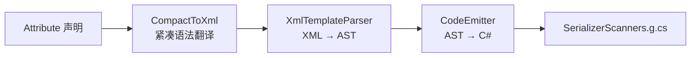

# 字面量扫描器 Source Generator

其核心设计问题：如何将字面量扫描从运行时（手写 Span 循环、反射、委托）移至编译期，在保持零分配和类型安全的同时，实现声明式定义和自动代码生成。

答案是四层 Source Generator 管线：开发者通过 attribute 声明数据格式，`IIncrementalGenerator` 在编译期将其翻译为专用 C# Span 扫描器，注入 `SerializerScanners` partial class。运行时零反射、零装箱、零委托分配。

## 四层管线



### 第一层: Attribute 声明

四个 attribute 构成声明式数据格式定义：

| Attribute | 目标 | 语义 |
|-----------|------|------|
| `[Template("...")]` | struct | 定义 struct 的字面量模板 |
| `[ExternalTemplate(typeof(X), "...")]` | assembly | 为第三方类型定义模板（不需修改原类型） |
| `[TypeAlias("Alias", "float")]` | assembly | 自定义类型别名，模板中可用别名替代完整类型名 |
| `[Tag("tag")]` | enum 成员 | 枚举成员的字符串标签，自动生成 tag→enum 扫描器 |

### 第二层: CompactToXml — 紧凑语法翻译

紧凑模板语法：

```
<float X> <float Y>
```

被翻译为标准 XML：

```xml
<literal-template>
  <field type="float" name="X"/>
  <text> </text>
  <field type="float" name="Y"/>
</literal-template>
```

开发者可使用紧凑格式或直接写 XML。`IsCompactFormat()` 检测是否以 `<literal-template` 开头来判定格式。

### 第三层: XmlTemplateParser — XML → AST

解析 XML 模板为 AST 节点树。四种节点类型：

| 节点 | XML 标签 | 语义 | 最少出现 | 最多出现 |
|------|---------|------|---------|---------|
| `LiteralTextNode` | `<text>...</text>` | 逐字符精确匹配字面量文本 | — | — |
| `FieldDirectiveNode` | `<field type="" name=""/>` | 调用对应类型扫描器读取值 | 1 | 1 |
| `OptionalBlockNode` | `<optional>...</optional>` | 尝试匹配内部节点，失败时回退继续 | 0 | 1 |
| `RepetitionBlockNode` | `<repetition>...</repetition>` | 循环匹配直到失败，回退退出循环 | 0 | ∞ |

模板依赖图构建与拓扑排序：当 struct A 的模板引用了 struct B，`BuildDependencyGraph` 构建有向图，检测循环依赖（SSR002），生成拓扑排序。`CodeEmitter` 按依赖顺序发射代码（被依赖者先发射）。

### 第四层: CodeEmitter — AST → C# 源码

生成的 `Scan_Xxx` 方法特征：

- 签名：`static T Scan_Xxx(scoped ReadOnlySpan<char> source, out int charsConsumed)`
- 裸文字块：逐字符比对 `source[consumed + i] == text[i]`
- 字段块：委托给对应类型的扫描器（内置或生成的）
- 可选块：保存/恢复 `consumed` 位置实现事务性回退
- 重复块：`while (true)` 循环 + 内部 try-match + 失败时 break

生成代码通过 `[MethodImpl(AggressiveInlining)]` 标注，注册在 `ScannerRegistry<TData>` 中。

## IIncrementalGenerator 输入管线

`LiteralScannerGenerator` 使用四个增量输入管线：

| Pipeline | 输入 | 过滤 | 输出 |
|----------|------|------|------|
| A | `[Template]` 标记的 struct | `StructDeclarationSyntax` | `StructInfo`（struct 名、字段、模板） |
| B | `[ExternalTemplate]` | 任意语法节点 | 与 Pipeline A 相同的 `StructInfo` |
| C | `[LiteralTypeAlias]` | assembly 级 attribute | 别名映射 |
| D | `[Tag]` 标记的 enum 成员 | `EnumMemberDeclarationSyntax` | tag→enum 扫描器 |

Pipeline B 的 `ExternalLiteralTemplate` 被设计为可覆盖 Pipeline A：同名 struct 的外部模板优先于内部模板，允许在不修改源码的情况下替换第三方类型的扫描器。

## 生成产物

```csharp
// SerializerScanners.g.cs (自动生成)
namespace FluxFormula.Core
{
    partial class LiteralScanners
    {
        static LiteralScanners()
        {
            // 注册所有生成的扫描器
            ScannerRegistry<Damage>.Scanner = Scan_Damage;
            ScannerRegistry<Vector3>.Scanner = Scan_Vector3;
        }

        [MethodImpl(MethodImplOptions.AggressiveInlining)]
        public static Damage Scan_Damage(
            scoped ReadOnlySpan<char> source, out int charsConsumed)
        {
            // 编译期生成的高性能 Span 扫描器
        }
    }
}
```

## 编译器诊断

| 代码 | 级别 | 描述 |
|------|------|------|
| SSR001 | Error | 模板解析错误（语法错误、非法类型名） |
| SSR002 | Error | 循环模板依赖（A 引用 B，B 引用 A） |
| SSR003 | Error | readonly struct 使用 LiteralTemplate（无法字段赋值） |
| SSR004 | Warning | 模板引用了无 LiteralTemplate 的非内置类型，对应字段被跳过 |

## 与 FluxLexer 的关系

`FluxLexer` 在构造时按优先级选择字面量扫描器：

1. `SerializerScanners.TryGetScanner<TData>()` — 如果存在 `[Template]` 定义
2. `config.LiteralScanner` 手动委托 — 回调兜底
3. 抛出 `ArgumentException` — 两者皆无

这种优先级设计确保 Source Generator 路径始终优先于运行时委托。

## 与 SourceSerializer 的基因关系

SourceSerializer（独立 UPM 库）的基因来自此管线。FluxFormula 中当前的四层管线（attribute → CompactToXml → XmlTemplateParser → CodeEmitter）将被剥离为独立的通用声明式序列化框架。FluxFormula 的 Lexer 大改后将成为 SourceSerializer 的第一个消费者：Token 定义、运算符定义、变量模式定义全部走向声明式 attribute 定义，SG 产出完整专用 Lexer。

## 参考

- [词法分析器](./lexer.md) — FluxLexer 如何消费生成的扫描器
- [字面量扫描器指南](../../guide/literal-scanner.md) — 面向用户的 API 使用指南
- [源码技术分析](../technical-analysis.md) — 逐行架构分析
