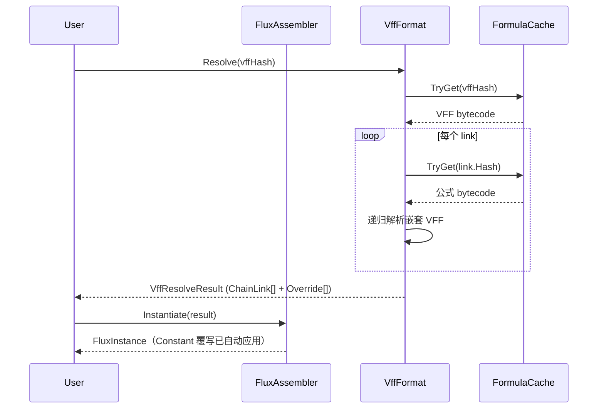

# VFF 持久化格式

其核心设计问题：如何引用和组合预编译的公式而不嵌入其完整字节码；在运行时按需解析，复用已有的 JIT 委托缓存。

VFF（Virtual FluxFormula）是 `ChainLink[]` 的持久化形态。不存储公式内容，存储对 blob 中已有公式的 `DualHash64` 引用 + 参数化覆写。

## DLL 类比

| 概念 | Blob / VFF 对应 |
|------|----------------|
| DLL（导出符号） | `.blob` 文件（导出公式字节码，按 DualHash64 索引） |
| Import Table（引用符号） | `.vff` 文件（引用 blob 中的公式 + 覆写参数） |
| Dynamic Linker（符号解析） | `VffFormat.Resolve()`（hash → ChainLink[] → FluxFormula） |

一个 `.vff` 文件不包含任何公式字节码，只包含"引用哪些 blob 公式 + 如何覆写参数"的指令。解析过程类似于动态链接：按哈希查找已缓存的字节码，组装为可执行的链式公式。

## 二进制布局

```
Offset  Size   Field
0       4      Magic: 'V' 'F' 'F' '\0'
4       1      Version: 1
5       1      LinkCount (uint8)
6       1      OverrideCount (uint8)
7       1      Flags (reserved)

──────────────────────────────────────────
LinkTable (offset 8): LinkCount × 22 bytes
──────────────────────────────────────────
  Each Link:
    0   16     DualHash64 (XxHash64 8 LE + FnvHash64 8 LE)
    16  1      ImmediateCount (uint8)
    17  2      InstructionCount (uint16 LE)
    19  1      FluxType (0=Formula, 1=Modifier)
    20  2      VariableSlotCount (uint16 LE)

──────────────────────────────────────────
OverrideTable (after LinkTable):
──────────────────────────────────────────
  Each Override:
    0   2      GlobalSlot (uint16 LE)
    2   1      Kind (0=Inject, 1=Constant)
    ── 若 Kind=Constant ──
    3   1      DataLen (uint8) = sizeof(TData)
    4   N      Data (TData value)
```

## Resolve 管线

`VffFormat.Resolve<TData, TDef>(hash)` 的解析流程：

1. 从 `FormulaCache` 查找 VFF 字节码（通过 `DualHash64`）
2. 解析 header：LinkCount, OverrideCount
3. 逐 link 遍历 LinkTable：
   - 从 `FormulaCache.TryGet(link.Hash)` 查找该 link 的公式字节码
   - 若该 link 本身是 VFF（通过 `FluxArtifactKind` 检测），递归 `Resolve`
   - 构建 `ChainLink`：Key, Bytecode, InstructionCount, Type, ImmediateCount, VarSlots, MaxRegister
   - 累加 `cumulativeSlotOffset`：每个 link 的 SlotIndex 偏移量递增
4. 构建 `VffResolveResult`：`ChainLink[]` + `VffOverride[]`

## 递归解析与 DAG 循环检测

VFF 支持嵌套引用：一个 VFF 的 link 可以引用另一个 VFF。解析器使用 `HashSet<DualHash64>` 追踪当前解析栈：

```csharp
if (!visited.Add(entry.Hash))
    throw new InvalidOperationException(
        $"Circular VFF reference detected: {entry.Hash}");
// 递归解析嵌套 VFF
var nested = Resolve<TData, TDef>(entry.Hash, visited);
visited.Remove(entry.Hash);
```

- 不重复解析同一 VFF：`visited` 中的 hash 被跳过（DAG 共享）
- 循环引用被拒绝：`Add` 返回 false 时抛出异常
- O(N) 时间复杂度，N = 所有被引用公式的总数

## Override 语义

两种覆写类型：

| Kind | 语义 | 应用时机 |
|------|------|---------|
| `Inject` (0) | 调用方在运行时通过 `FluxInjector.Set` 注入 | 用户代码 |
| `Constant` (1) | 硬编码在 VFF 字节中的固定值 | `Assembler.Instantiate`（v5.9.1 自动） |

`GlobalSlot` 是合并后链式空间的全局槽位索引。每个 link 的 SlotIndex 经过 `cumulativeSlotOffset` 叠加转换为全局索引。

**v5.9.1 自动应用**：`FluxAssembler.Instantiate(chain)` 检测链中的 `VffOverride[]`，通过 `TrySet` 自动应用 Constant 覆写。Inject 覆写留给调用方处理。

## 使用流程



## 参考

- [ChainLink 深度解析](./chainlink-deep-dive.md) — ChainLink 结构与 per-link JIT 缓存
- [编译缓存管线](./compile-cache.md) — DualHash64 + FormulaCache 哈希查询基础
- [数据注入器](./pipeline/injector.md) — TrySet 静默注入（VFF 覆写应用机制）
- [VFF 持久化示例](../examples/vff-persistence.md) — 面向用户的保存/加载往返示例
